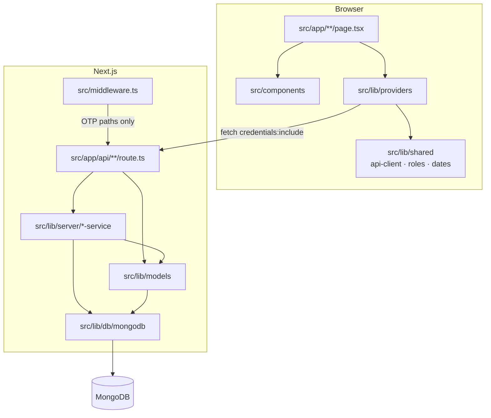
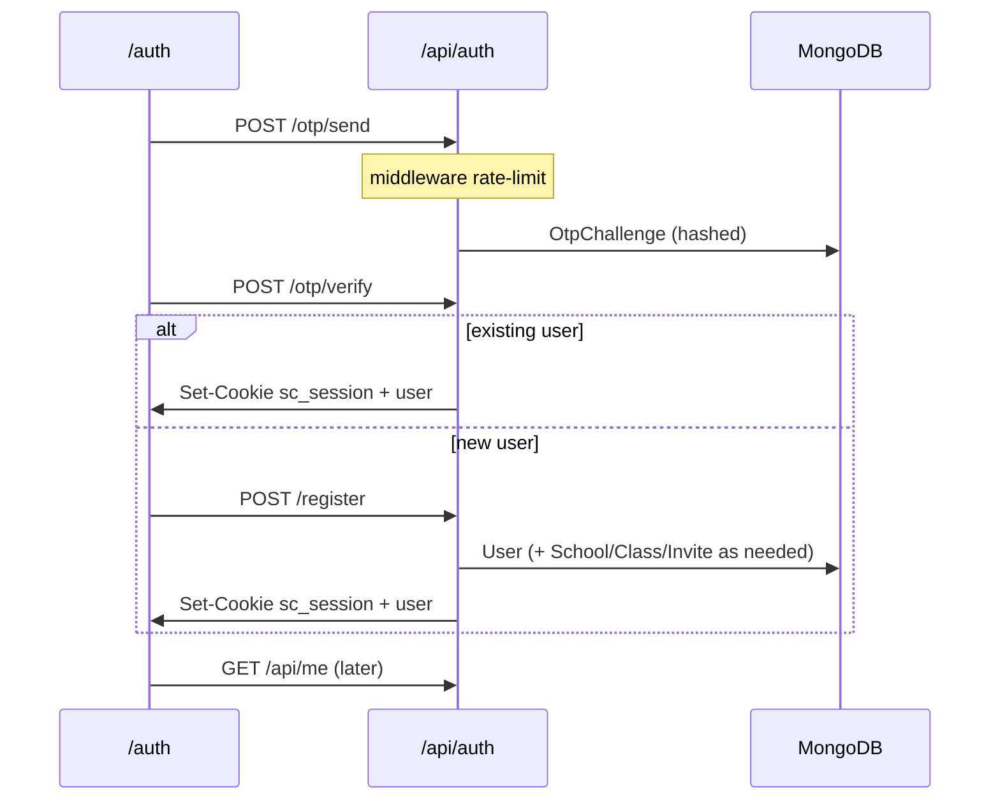

# SchoolConnect — System & Source Architecture

Current architecture after the Mongo/API migration, feature hardening (chats, circulars, family parity), and **`src/` layout** reorganization.

Related docs:

| Doc | Contents |
|-----|----------|
| [README.md](../README.md) | Setup, seed, demo accounts, scripts |
| [BACKEND.md](BACKEND.md) | API routes + Mongo models |
| [ROLES-AND-FEATURES.md](ROLES-AND-FEATURES.md) | Per-role UI/API access matrix |
| [NEXT-TASKS.md](NEXT-TASKS.md) | Ordered next sprint |
| [BACKLOG.md](BACKLOG.md) | Shipped + open roadmap |
| [DEPLOY.md](DEPLOY.md) | Docker / VPS |

---

## 1. Stack snapshot

| Piece | Choice |
|-------|--------|
| Framework | **Next.js 15** App Router + **React 19** + **TypeScript** |
| Styling | Plain CSS — `src/app/globals.css` (mobile-first phone shell) |
| Data | **MongoDB** + **Mongoose** |
| Auth | OTP → httpOnly JWT cookie `sc_session` (`jose`) |
| Validation | **Zod** (`src/lib/server/schemas.ts`) |
| Tests | **Vitest** under `tests/` (outside `src/`) |
| Alias | `@/*` → `src/*` (`tsconfig.json`) |

**URLs are stable:** files live under `src/app/…`, but browser paths stay `/chats`, `/api/fees`, etc.

---

## 2. Repository layout (canonical)

```text
schoolconnect/
├── src/                          # ALL application source
│   ├── app/                      # Next.js App Router
│   │   ├── layout.tsx            # Providers + global CSS
│   │   ├── page.tsx              # Role-aware home
│   │   ├── globals.css
│   │   ├── api/                  # REST handlers → /api/*
│   │   └── <route>/page.tsx      # UI screens
│   ├── components/               # Shared UI (PhoneShell, Icons, …)
│   ├── lib/
│   │   ├── providers/            # Client React contexts
│   │   ├── shared/               # Isomorphic helpers (safe in client+server)
│   │   ├── server/               # Server-only services & guards
│   │   ├── models/               # Mongoose schemas + *ToClient
│   │   └── db/mongodb.ts         # Connection helper
│   └── middleware.ts             # OTP rate-limit (/api/auth/otp/*)
├── public/                       # Static (robots.txt, …)
├── tests/                        # Unit tests (Vitest)
├── scripts/seed.ts               # Demo Mongo seed
├── docs/                         # This folder
├── deploy/                       # Dockerfile + compose
├── package.json
├── tsconfig.json                 # paths: @/* → ./src/*
├── next.config.ts
├── vitest.config.mts
└── eslint.config.mjs
```

| Inside `src/` | Outside `src/` |
|---------------|----------------|
| Pages, API, components, lib, middleware | `public`, `tests`, `scripts`, `docs`, `deploy`, configs, env templates |

---

## 3. Runtime layers



| Layer | Path | Responsibility |
|-------|------|----------------|
| UI routes | `src/app/**/page.tsx` | Screens only — no business DB access |
| Components | `src/components/` | Shell, icons, enrollment desk, status UI |
| Providers | `src/lib/providers/` | Client state; `apiFetch` when Mongo is up |
| Shared | `src/lib/shared/` | Pure helpers usable on client + server |
| API | `src/app/api/**/route.ts` | HTTP boundary |
| Server | `src/lib/server/` | Auth, Zod, domain services, seed bootstrap |
| Models | `src/lib/models/` | Schemas + `*ToClient` DTOs |
| DB | `src/lib/db/mongodb.ts` | `connectMongo` (`MONGO_URI` \| `MONGODB_URI`) |
| Middleware | `src/middleware.ts` | In-memory OTP rate limit |

**Import rule:**

```ts
import { useAuth } from "@/lib/providers/auth";
import { apiFetch } from "@/lib/shared/api-client";
import { requireUser } from "@/lib/server/http"; // server / route only
```

Do **not** import `src/lib/server/*` from client components.

---

## 4. Provider tree (`src/app/layout.tsx`)

```text
AuthProvider
  └─ SchoolDataProvider          # chats, homework, notifications
       └─ TeacherClassProvider   # roster, attendance, circulars
            └─ StudentEngageProvider  # XP / missions (family writes)
                 └─ LeavesProvider
                      └─ EnrollmentProvider
                           └─ BusTrackProvider
                                └─ AdminDataProvider
                                     └─ {children}
```

**Dependencies**

- Auth wraps everything (session + `backend` flag from `/api/health`).
- BusTrack → SchoolData (`pushNotification`).
- TeacherClass → SchoolData (`upsertChat`, `refreshNotifications`).
- Enrollment / Admin → Auth (`updateUser`, user directory).

Barrel re-exports: `src/lib/providers/index.ts`.

---

## 5. Auth & session flow



| Piece | Detail |
|-------|--------|
| Cookie | `sc_session` — httpOnly JWT |
| Secret | Dedicated `JWT_SECRET` (min 16 chars) — `src/lib/server/secrets.ts` |
| Guards | `requireUser` / `requireDb` — `src/lib/server/http.ts` |
| JSON helpers | `jsonOk` / `jsonError` — `src/lib/server/response.ts` |

---

## 6. API vs localStorage

On boot, `AuthProvider` calls `GET /api/health`.

| Health | Mode |
|--------|------|
| `mongo: true` | Providers load/mutate via `apiFetch` — **API is source of truth** |
| `mongo: false` / down | Providers use `localStorage` keys (`sc_*_v1`) for UI demo only |

---

## 7. Domain map (provider ↔ API ↔ server)

| Domain | Provider | Primary APIs | Server module(s) |
|--------|----------|--------------|------------------|
| Auth / users | `auth` | `/api/auth/*`, `/api/me`, `/api/users` | `auth`, `otp-service`, `secrets` |
| Chats / HW / notifs | `school-data` | `/api/chats`, `/api/homework`, `/api/notifications` | `chat-service`, `seed-school` |
| Class desk / circulars | `teacher-class` | `/api/class-desk` | `circular-service` |
| Engage (Zone) | `student-engage` | `/api/engage` | `engage-service` |
| Leaves | `leaves` | `/api/leaves` | — |
| Enrollment | `enrollment` | `/api/invites`, `/api/enrollments` | `enrollment-service` |
| Bus | `bus-track` | `/api/bus` | `bus-service` |
| Admin | `admin-data` | `/api/admin` | — |
| Fees | page + apiFetch | `/api/fees` | `fees-service` |
| Home feed / attendance | home page | `/api/feed`, `/api/attendance/summary` | `feed-service`, `attendance-service` |
| AI | `/ai` page | `/api/ai/chat` | `ai-service` |
| Parent↔student | links APIs | `/api/links` | `link-service` |

Shared defaults: `src/lib/shared/engage-defaults.ts`, `bus-defaults.ts`, `roles.ts`.

---

## 8. UI route map (`src/app`)

| Path | Screen | Notes |
|------|--------|-------|
| `/` | Home | Family / teacher / admin dashboards |
| `/auth` | Login / signup OTP | |
| `/pending` | Enrollment wait | Students / pending staff |
| `/chats`, `/chats/[id]` | Messaging | Soft poll; optimistic send |
| `/homework` | Homework | Create = teacher/principal |
| `/engage` | Learning Zone | Writes = parent + student |
| `/fees` | Fees | Own ledger + demo Pay |
| `/attendance` | Calendar / mark | Mark UI = teacher |
| `/circulars` | Notices | Publish = broadcast roles |
| `/bus` | Live bus | Progress write = attendant/admin/principal |
| `/class` | Teacher desk | `canPostAsTeacher` only |
| `/admin` | Admin console | `admin` / `super_admin` UI |
| `/notifications` | Alerts | |
| `/profile` | Account + leave + sign out | |
| `/ai` | School AI | Full-screen, `hideNav` |

Role matrix detail: [ROLES-AND-FEATURES.md](ROLES-AND-FEATURES.md).

---

## 9. Server services (`src/lib/server`)

| File | Role |
|------|------|
| `auth.ts` | JWT sign/verify, cookie options |
| `http.ts` | `requireUser`, `withApiHandler` |
| `response.ts` | `jsonOk` / `jsonError` |
| `request.ts` | JSON parse + trimmed fields |
| `validate.ts` + `schemas.ts` | Zod body parsing |
| `secrets.ts` | `JWT_SECRET` |
| `hash.ts` / `otp-service.ts` | Hashed OTP + rate limits |
| `chat-service.ts` | Send message, unread bump, welcome msg |
| `circular-service.ts` | Publish circular + notification fan-out |
| `engage-service.ts` | Server-authoritative XP |
| `fees-service.ts` | Ledger ensure + demo pay |
| `bus-service.ts` | Route/state DTO |
| `attendance-service.ts` | Monthly % summary |
| `feed-service.ts` | Home “Recent” |
| `ai-service.ts` | Rule-based assistant |
| `enrollment-service.ts` | Student self-enrollment row |
| `link-service.ts` | Parent ↔ student links |
| `seed-school.ts` | Idempotent demo chats/HW/desk/bus/fees |

---

## 10. Models (`src/lib/models`)

`School`, `User`, `Class`, `OtpChallenge`, `TeacherInvite`, `StudentEnrollment`, `Chat`, `Message`, `Homework`, `Notification`, `Leave`, `ClassDesk`, `AdminData`, `StudentEngage`, `ParentStudentLink`, `BusRoute`, `BusState`, `FeeAccount`.

Each exposes a `*ToClient` mapper for JSON responses.

---

## 11. Cross-cutting product rules

| Topic | Behavior |
|-------|----------|
| **Family parity** | `parent` ≈ `student` nav + Zone + Fees (`isFamilyRole`) |
| **Teacher UI** | `canPostAsTeacher` → `class_teacher` + `principal` (not admin) |
| **Broadcast** | Circulars / school notifs → `canBroadcastNotification` |
| **Bus write** | Progress/reset → `canWriteBusProgress` |
| **Polling** | School data ~12s on `/chats`, ~25s elsewhere; pause when tab hidden |
| **Bus sim** | Interval only on `/bus` or family home |
| **Pending gate** | Unapproved enrollment → `/pending` + Status/Profile nav only |

---

## 12. Request path (typical mutation)

```text
Page → Provider method → apiFetch("/api/…")
  → middleware? (OTP only)
  → route.ts → parseBodyWithSchema (Zod)
  → requireUser([roles?])
  → *-service / Model
  → jsonOk({ … })
  → Provider setState (+ optional refreshNotifications)
```

---

## 13. Adding a feature (checklist)

1. Model in `src/lib/models/` (+ `toClient`)
2. Service in `src/lib/server/` if logic is reusable
3. Route under `src/app/api/<resource>/`
4. Provider method in `src/lib/providers/` (guard with `backend`)
5. Page under `src/app/<route>/page.tsx`
6. Update **BACKEND.md** API map + **ROLES-AND-FEATURES.md** if access differs by role
7. Add/adjust Vitest under `tests/` when pure helpers change

---

## 14. Tooling paths

| Tool | Config | Notes |
|------|--------|-------|
| TypeScript | `tsconfig.json` | `include`: `src/**`, `scripts/**`, `tests/**` |
| Vitest | `vitest.config.mts` | Alias `@` → `./src` |
| ESLint | `eslint.config.mjs` | Next core-web-vitals |
| Docker | `deploy/Dockerfile` | Build context = repo root (sees `src/`) |
| Seed | `npm run seed` | Imports `../src/lib/…` |

---

*Keep this file aligned with the tree under `src/`. Role product details live in ROLES-AND-FEATURES.md; HTTP details in BACKEND.md.*
