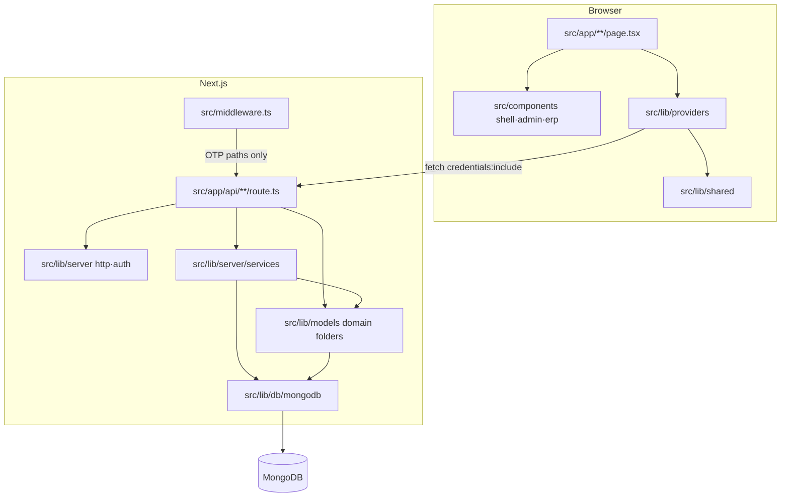
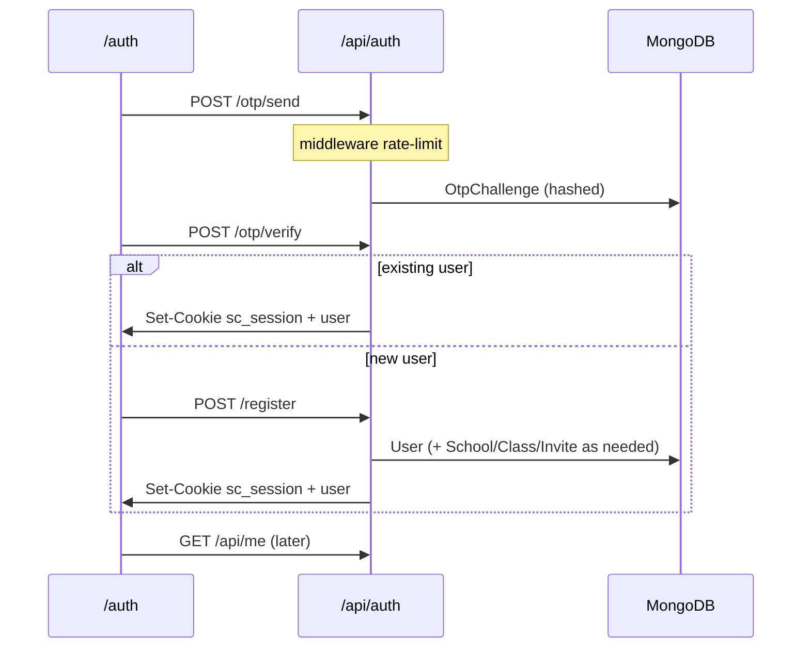

# SchoolConnect — System & Source Architecture

Monorepo layout after Mongo/API migration, family parity, ERP, transfers, CSV MDM, and modular `/api/v1`.

**Docs hub:** [README.md](./README.md) · **BRD:** [BRD.md](./BRD.md) · **Modes:** [PRODUCT-MODES.md](PRODUCT-MODES.md) · **API map:** [BACKEND.md](BACKEND.md) · **ERP:** [ERP.md](ERP.md) · **CSV:** [DATA-IMPORT-EXPORT.md](DATA-IMPORT-EXPORT.md)

---

## 1. Stack snapshot

| Piece | Choice |
|-------|--------|
| Framework | **Next.js 15** App Router + **React 19** + **TypeScript** |
| Styling | Plain CSS — `src/app/globals.css` (mobile-first phone shell) |
| Data | **MongoDB** + **Mongoose** |
| Auth | OTP → httpOnly JWT cookie `sc_session` (`jose`) |
| Validation | **Zod** (`apps/web` schemas + `@schoolconnect/shared`) |
| Tests | **Vitest** under `apps/web/tests/` |
| Alias | `@/*` → `apps/web/src/*` |

---

## 2. Repository layout (canonical)

```text
schoolconnect/
├── apps/
│   ├── web/                         # Next.js UI + /api
│   │   └── src/
│   │       ├── app/                 # Pages + api/ + erp/
│   │       ├── components/
│   │       │   ├── shell/           # PhoneShell, StatusUI, Icons, …
│   │       │   ├── admin/           # EnrollmentDesk
│   │       │   └── erp/             # ErpShell, CSV, TransferDesk
│   │       ├── lib/
│   │       │   ├── db/
│   │       │   ├── models/          # core · comms · ops · family · erp
│   │       │   ├── providers/
│   │       │   ├── server/          # http/auth infra + services/
│   │       │   └── shared/          # apiFetch + package re-exports
│   │       ├── modules/             # /api/v1 domain modules
│   │       ├── shared/              # v1 RBAC + tenant helpers
│   │       └── STRUCTURE.md         # Folder roles cheat-sheet
│   └── mobile/                      # React Native Family MVP
├── packages/
│   └── shared/                      # @schoolconnect/shared
├── docs/
├── deploy/
└── README.md
```

Web alias `@/*` → `apps/web/src/*`. Browser URLs stay `/chats`, `/api/fees`, `/erp`, etc.
Folder cheat-sheet: [`apps/web/src/STRUCTURE.md`](../apps/web/src/STRUCTURE.md).

---

## 3. Runtime layers



| Layer | Path | Responsibility |
|-------|------|----------------|
| UI routes | `src/app/**/page.tsx` | Screens only — no business DB access |
| Components | `src/components/{shell,admin,erp}/` | Shell chrome, enrollment desk, ERP panels |
| Providers | `src/lib/providers/` | Client state; `apiFetch` when Mongo is up |
| Shared | `src/lib/shared/` | Pure helpers usable on client + server |
| API | `src/app/api/**/route.ts` | HTTP boundary |
| Server | `src/lib/server/` | Auth/HTTP infra; domain logic in `services/` |
| Models | `src/lib/models/{core,comms,ops,family,erp}/` | Schemas + `*ToClient` DTOs |
| DB | `src/lib/db/mongodb.ts` | `connectMongo` (`MONGO_URI` \| `MONGODB_URI`) |
| Middleware | `src/middleware.ts` | In-memory OTP rate limit |

**Import rule:**

```ts
import { useAuth } from "@/lib/providers/auth";
import { apiFetch } from "@/lib/shared/api-client";
import { requireUser } from "@/lib/server/http"; // server / route only
```

Do **not** import `src/lib/server/*` from client components.

---

## 4. Provider tree (`src/app/layout.tsx`)

```text
AuthProvider
  └─ SchoolDataProvider          # chats, homework, notifications
       └─ TeacherClassProvider   # roster, attendance, circulars
            └─ StudentEngageProvider  # XP / missions (family writes)
                 └─ LeavesProvider
                      └─ EnrollmentProvider
                           └─ BusTrackProvider
                                └─ AdminDataProvider
                                     └─ {children}
```

**Dependencies**

- Auth wraps everything (session + `backend` flag from `/api/health`).
- BusTrack → SchoolData (`pushNotification`).
- TeacherClass → SchoolData (`upsertChat`, `refreshNotifications`).
- Enrollment / Admin → Auth (`updateUser`, user directory).

Barrel re-exports: `src/lib/providers/index.ts`.

---

## 5. Auth & session flow



| Piece | Detail |
|-------|--------|
| Cookie | `sc_session` — httpOnly JWT |
| Secret | Dedicated `JWT_SECRET` (min 16 chars) — `src/lib/server/secrets.ts` |
| Guards | `requireUser` / `requireDb` — `src/lib/server/http.ts` |
| JSON helpers | `jsonOk` / `jsonError` — `src/lib/server/response.ts` |

---

## 6. API vs localStorage

On boot, `AuthProvider` calls `GET /api/health`.

| Health | Mode |
|--------|------|
| `mongo: true` | Providers load/mutate via `apiFetch` — **API is source of truth** |
| `mongo: false` / down | Providers use `localStorage` keys (`sc_*_v1`) for UI demo only |

---

## 7. Domain map (provider ↔ API ↔ server)

| Domain | Provider | Primary APIs | Server module(s) |
|--------|----------|--------------|------------------|
| Auth / users | `auth` | `/api/auth/*`, `/api/me`, `/api/users` | `auth`, `otp-service`, `secrets` |
| Chats / HW / notifs | `school-data` | `/api/chats`, `/api/homework`, `/api/notifications` | `chat-service`, `seed-school` |
| Class desk / circulars | `teacher-class` | `/api/class-desk` | `circular-service` |
| Engage (Zone) | `student-engage` | `/api/engage` | `engage-service` |
| Leaves | `leaves` | `/api/leaves` | — |
| Enrollment | `enrollment` | `/api/invites`, `/api/enrollments` | `enrollment-service` |
| Bus | `bus-track` | `/api/bus` | `bus-service` |
| Admin | `admin-data` | `/api/admin` | — |
| Fees | page + apiFetch | `/api/fees` | `fees-service` |
| Home feed / attendance | home page | `/api/feed`, `/api/attendance/summary` | `feed-service`, `attendance-service` |
| AI | `/ai` page | `/api/ai/chat` | `ai-service` |
| Parent↔student | links APIs | `/api/links` | `link-service` |
| ERP MDM | `/erp/*` pages | `/api/erp/*` (+ `students/csv`, `staff/csv`) | `erp`, `student-sync`, `csv`, models |
| Campus transfers | `/transfers`, `/erp/transfers` | `/api/erp/transfers` | `BranchTransfer` + `erp` |

Shared defaults: `src/lib/shared/engage-defaults.ts`, `bus-defaults.ts`, `roles.ts`.

---

## 8. UI route map (`src/app`)

| Path | Screen | Notes |
|------|--------|-------|
| `/` | Home | Family / teacher / admin dashboards |
| `/auth` | Login / signup OTP | |
| `/pending` | Enrollment wait | Students / pending staff |
| `/chats`, `/chats/[id]` | Messaging | Soft poll; optimistic send |
| `/homework` | Homework | Create = teacher/principal |
| `/engage` | Learning Zone | Writes = parent + student |
| `/fees` | Fees | Own ledger + demo Pay |
| `/attendance` | Calendar / mark | Mark UI = teacher |
| `/circulars` | Notices | Publish = broadcast roles |
| `/bus` | Live bus | Progress write = attendant/admin/principal |
| `/class` | Teacher desk | `canPostAsTeacher` only |
| `/admin` | Admin console | `admin` / `super_admin` UI |
| `/notifications` | Alerts | |
| `/profile` | Account + leave + sign out | |
| `/ai` | School AI | Full-screen, `hideNav` |
| `/transfers` | Campus transfer desk | Connect (+ ERP admins); same API as `/erp/transfers` |
| `/erp/*` | Desktop MDM | ERP mode + subscription; see [ERP.md](ERP.md) |

Role matrix detail: [ROLES-AND-FEATURES.md](ROLES-AND-FEATURES.md).
CSV bulk load: [DATA-IMPORT-EXPORT.md](DATA-IMPORT-EXPORT.md).

---

## 9. Server (`src/lib/server`)

**Infra (stay at package root):**

| File | Role |
|------|------|
| `auth.ts` | JWT sign/verify, cookie options |
| `http.ts` | `requireUser`, `withApiHandler` |
| `response.ts` | `jsonOk` / `jsonError` |
| `request.ts` | JSON parse + trimmed fields |
| `validate.ts` + `schemas.ts` | Zod body parsing |
| `secrets.ts` | `JWT_SECRET` |
| `hash.ts` | OTP HMAC helpers |

**Domain (`services/`):** `otp-service`, `chat-service`, `circular-service`, `engage-service`, `fees-service`, `bus-service`, `attendance-service`, `feed-service`, `ai-service`, `enrollment-service`, `link-service`, `leave-attendance`, `erp`, `csv`, `student-sync`, `school-group`, `seed-school`.

Import example: `import { issueOtp } from "@/lib/server/services/otp-service"`.

---

## 10. Models (`src/lib/models`)

| Folder | Models |
|--------|--------|
| `core/` | `School`, `User`, `Class`, `OtpChallenge`, `TeacherInvite`, `StudentEnrollment`, `AdminData` |
| `comms/` | `Chat`, `Message`, `Homework`, `Notification` |
| `ops/` | `Leave`, `ClassDesk`, `BusRoute`, `BusState` |
| `family/` | `StudentEngage`, `ParentStudentLink`, `FeeAccount` |
| `erp/` | `StudentProfile`, `StaffProfile`, admissions, subjects, exams, fee MDM, sessions, transfers, audit |

Barrel: `import { … } from "@/lib/models"`. Each file exposes `*ToClient` where needed.

---

## 11. Cross-cutting product rules

| Topic | Behavior |
|-------|----------|
| **Family parity** | `parent` ≈ `student` nav + Zone + Fees (`isFamilyRole`) |
| **Teacher UI** | `canPostAsTeacher` → `class_teacher` + `principal` (not admin) |
| **Broadcast** | Circulars / school notifs → `canBroadcastNotification` |
| **Bus write** | Progress/reset → `canWriteBusProgress` |
| **Polling** | School data ~12s on `/chats`, ~25s elsewhere; pause when tab hidden |
| **Bus sim** | Interval only on `/bus` or family home |
| **Pending gate** | Unapproved enrollment → `/pending` + Status/Profile nav only |
| **Product mode** | `productMode` + subscription gate ERP APIs; Connect keeps `/transfers` |
| **CSV MDM** | Students/staff import upsert profiles only — no OTP users |

---

## 12. Request path (typical mutation)

```text
Page → Provider method → apiFetch("/api/…")
  → middleware? (OTP only)
  → route.ts → parseBodyWithSchema (Zod)
  → requireUser([roles?])
  → *-service / Model
  → jsonOk({ … })
  → Provider setState (+ optional refreshNotifications)
```

---

## 13. Adding a feature (checklist)

1. Model in `src/lib/models/{core|comms|ops|family|erp}/` (+ `toClient`)
2. Service in `src/lib/server/services/` if logic is reusable
3. Route under `src/app/api/<resource>/`
4. Provider method in `src/lib/providers/` (guard with `backend`)
5. Page under `src/app/<route>/page.tsx`
6. Update **BACKEND.md** API map + **ROLES-AND-FEATURES.md** if access differs by role
7. Add/adjust Vitest under `tests/` when pure helpers change

---

## 14. Tooling paths

| Tool | Config | Notes |
|------|--------|-------|
| TypeScript | `tsconfig.json` | `include`: `src/**`, `scripts/**`, `tests/**` |
| Vitest | `vitest.config.mts` | Alias `@` → `./src` |
| ESLint | `eslint.config.mjs` | Next core-web-vitals |
| Docker | `deploy/Dockerfile` | Build context = repo root (sees `src/`) |
| Seed | `npm run seed` | Imports web `src/lib/…` |

---

## 15. Modular API (`modules/` + `/api/v1`)

Domain modules + versioned routes. Legacy `/api/*` and `/api/erp/*` stay for web + mobile.

```text
apps/web/src/
├── app/api/
│   ├── v1/                 # Preferred for new clients
│   ├── erp/                # Desktop ERP convenience APIs
│   └── …                   # Existing app routes (auth, chats, …)
├── modules/                # student · school · class · attendance · fee · leave · user
├── shared/                 # auth · rbac · tenant
└── lib/models/             # Canonical Mongoose schemas
```

```text
Client → JWT (cookie/Bearer) → Authentication → Authorization (rbac + tenantSchoolId)
  → module controller → service → repository → Mongo (always schoolId-scoped)
```

| Method | Path | Module |
|--------|------|--------|
| GET | `/api/v1/auth/me` | session + permissions (+ capabilities) |
| GET/POST/PATCH | `/api/v1/students` | student |
| GET/PATCH | `/api/v1/students/:id` | student |
| GET | `/api/v1/schools` | school |
| GET | `/api/v1/classes` | class |
| GET | `/api/v1/attendance` | attendance |
| GET | `/api/v1/fees` | fees |
| GET/PATCH | `/api/v1/leaves` | leaves |
| GET | `/api/v1/users` | users |

**Tenant rule:** never bare `find({})` for school data — use `withTenantFilter`. `super_admin` may pass `?schoolId=`.

**Fee collections:** `FeeStructure` (catalog) · `FeeInvoice` · `FeePayment` · `FeeAccount` (family ledger).

**Compatibility:** PhoneShell + mobile keep `/api/*`; ERP may keep `/api/erp/*`; new integrations prefer `/api/v1/*`.

---

*Keep aligned with `apps/web/src` and `packages/shared`. Roles → [ROLES-AND-FEATURES.md](ROLES-AND-FEATURES.md). HTTP map → [BACKEND.md](BACKEND.md). Hub → [README.md](./README.md).*
