# SchoolConnect — Business Requirements Document (BRD)

| Field | Value |
|-------|--------|
| Product | SchoolConnect AI |
| Version | 1.2 (CSV import/export · ERP module completeness · architecture links) |
| Audience | Product, school admins, engineering, stakeholders |
| Related | [Docs hub](./README.md) · [PRODUCT-MODES.md](./PRODUCT-MODES.md) · [ROLES-AND-FEATURES.md](./ROLES-AND-FEATURES.md) · [ERP.md](./ERP.md) · [DATA-IMPORT-EXPORT.md](./DATA-IMPORT-EXPORT.md) · [ARCHITECTURE.md](./ARCHITECTURE.md) · [BACKEND.md](./BACKEND.md) · [Root README](../README.md) |

---

## 1. Executive summary

SchoolConnect is a **WhatsApp-first school communication and management platform**. Tenants are defined on **two independent axes** (same deploy, database, and API):

| | **Connect** | **Full ERP** |
|--|-------------|--------------|
| **Single campus** | Collab app only | Collab + desktop `/erp` MDM |
| **Multi-campus (group)** | Collab + campus `/transfers` | Same + full MDM per campus |

| Mode | Intent |
|------|--------|
| **Connect** | Chats, homework, circulars, bus, leave, teacher attendance, light admin, **campus transfers** |
| **Full ERP** | Connect **plus** `/erp`: SIS, staff MDM, admissions, fees, exams, ID cards, audit, **student/teacher CSV**, transfers |

**Subscription:** every school starts on a **free plan for ~1 year** (`subscriptionExpiresAt`); Super Admin can extend the end date (no payment gateway yet).

Families use a **phone-shell web app** and a **React Native** Family MVP. Staff use the same app plus (in ERP mode) a **desktop ERP console**.

**Core value:** one school tenant → one source of truth for attendance, leave, fees, and messaging — without separate apps or databases per product line.

---

## 2. Business goals & success criteria

| Goal | Success looks like |
|------|-------------------|
| Replace scattered WhatsApp groups | Class/teacher chats + circulars + notifications in one app |
| Reduce attendance / leave chaos | Teacher day sheet; approved leave auto-marks **L** |
| Optional full school ops | ERP schools manage students, fees, exams without a second product |
| Simple onboarding | Super Admin creates school as Connect or ERP; upgrade anytime |
| Multi-client parity | Web + mobile share `/api`; JWT cookie or Bearer |

**Out of scope (Phase 1 BRD):** Library, Hostel, full HR/Payroll, biometric devices, live payment gateway settlement, WhatsApp Business API / SMS OTP in production (demo OTP supported).

---

## 3. Stakeholders & personas

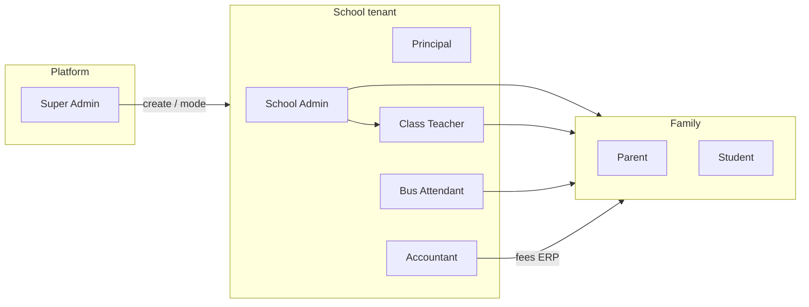

| Persona | Needs |
|---------|--------|
| Super Admin | Onboard schools, set `productMode` / `groupCode` / transfer policy / subscription end date |
| School Admin | Users, invites, enrollments, sessions, promotions; transfers; ERP if enabled |
| Principal | Oversight + transfers + ERP when mode allows |
| Accountant | Fee structures / invoices in ERP |
| Class Teacher | Roster, attendance, homework, chats, leave approve |
| Bus Attendant | Update bus progress; families see ETA |
| Parent | Child day: attendance, homework, bus, leave, fees (when module on) |
| Student | Same family surface + Learning Zone |

---

## 4. Product modes (Connect vs ERP)

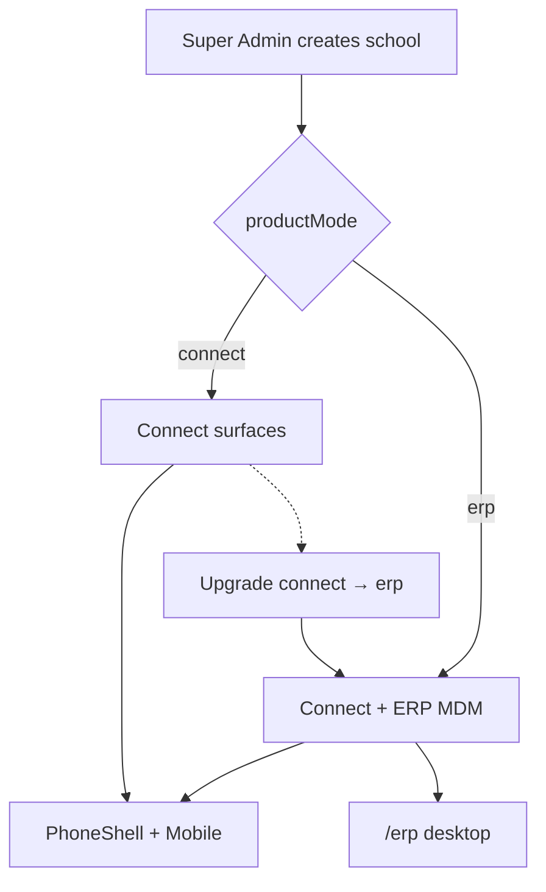

| Capability | Connect | ERP |
|------------|---------|-----|
| Chats, homework, circulars, notifications | Yes | Yes |
| Bus tracking | Yes* | Yes* |
| Leave apply / approve → attendance L | Yes | Yes |
| Teacher class desk / day attendance | Yes | Yes |
| Light `/admin` + **`/transfers`** | Yes | Yes |
| Family Fees pay UI | Hidden by default* | On by default* |
| `/erp` SIS, staff, admissions, exams, fee MDM, ID cards, audit | No (403 / redirect) | Yes |
| Student & teacher **CSV** import/export | No | Yes |

\*Per-campus `settings.modules` can override (e.g. one branch `fees: false`, another `bus: false`).

Details: [PRODUCT-MODES.md](./PRODUCT-MODES.md).

---

## 4.1 Campus structure & transfers

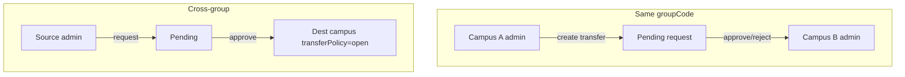

| Field | Meaning |
|-------|---------|
| `groupCode` | Shared id for multi-campus groups (e.g. `RADMOS`, `SUNRISE`) |
| `transferPolicy: group_only` | Transfers only within same group (default) |
| `transferPolicy: open` | Campus may **receive** students from outside its group |

- UI: Connect → `/transfers`; ERP → `/erp/transfers` (same API).
- Destination school admin always approves; on approve, student (+ linked parent) move to dest campus/class.

---

## 4.2 Subscription (free ~1 year)

| Field | Default |
|-------|---------|
| `subscriptionPlan` | `free` |
| `subscriptionExpiresAt` | now + **365 days** |

Super Admin edits end date on `/erp/schools`. Expired subscription blocks ERP console APIs (403) until extended. Not a payment gateway — date flag only.

---

## 5. System context & architecture

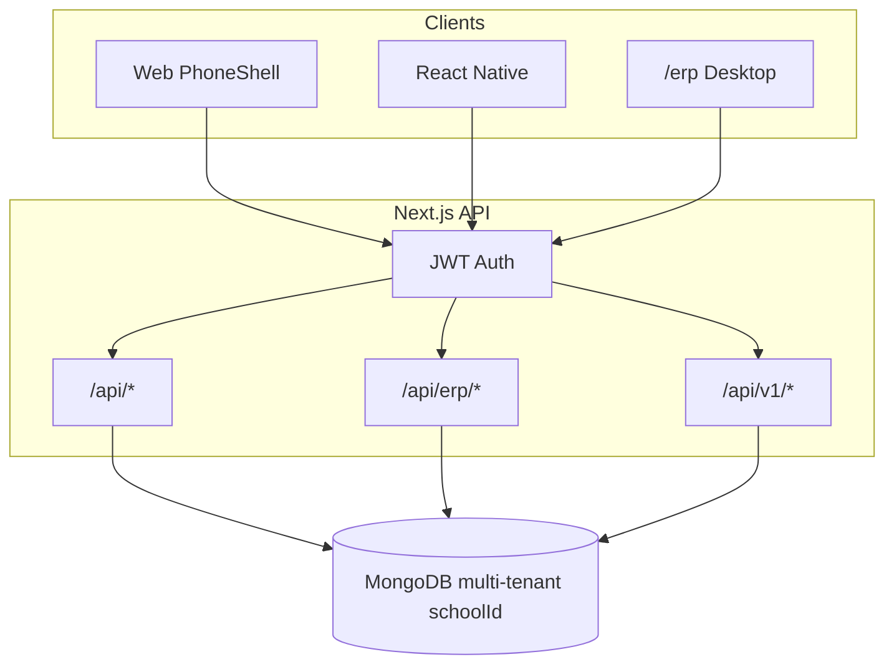

| Concern | Where documented |
|---------|------------------|
| Monorepo layout, providers, request path, `/api/v1` | **[ARCHITECTURE.md](./ARCHITECTURE.md)** |
| Auth, HTTP map, Mongo collections | **[BACKEND.md](./BACKEND.md)** |
| Deploy (Docker / Compose) | **[DEPLOY.md](./DEPLOY.md)** |
| Setup, seed, demo logins | **[Root README](../README.md)** |

- **Tenant key:** `schoolId` on user and school-scoped collections.  
- **Auth:** OTP → JWT (`sc_session` cookie on web; Bearer on mobile).  
- **Capabilities:** `/api/me` returns `productMode`, `capabilities`, `transferPolicy`, `subscriptionActive` / `subscriptionExpiresAt`.

---

## 6. Feature & functionality catalog

### 6.1 Authentication & session

**Functionality**

- Sign in with **phone or email**
- OTP issue / verify (demo OTP `000000` when demo mode on)
- Complete registration: name, role, school, optional class / child
- Teachers / staff may require **invite code**
- Session refresh via `GET /api/me` (includes capabilities)
- Logout clears cookie / token

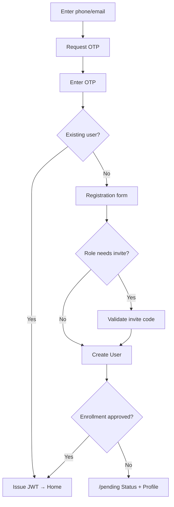

---

### 6.2 Enrollment & pending gate

**Functionality**

- Admin / class teacher invite teachers and add students
- Student self-enrollment row
- Until `enrollmentStatus === approved`, user only sees **Status** + **Profile** (`/pending`)
- Approval can sync roster / StudentProfile (ERP path)

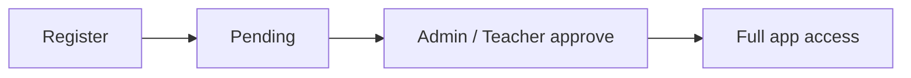

---

### 6.3 Home & role dashboards

**Functionality**

- Role-aware home: family / teacher / admin shortcuts
- Family: attendance snapshot, homework, bus ETA, Zone, optional fees
- Teacher: class desk, unmarked attendance prompts
- Admin: link to `/admin` and ERP (when allowed)

---

### 6.4 Chats (WhatsApp-style)

**Functionality**

- List school threads (class / teacher DMs)
- Send text; teachers may post homework / activity / progress kinds
- Unread badges; soft polling while on chats
- Tenant-scoped to school

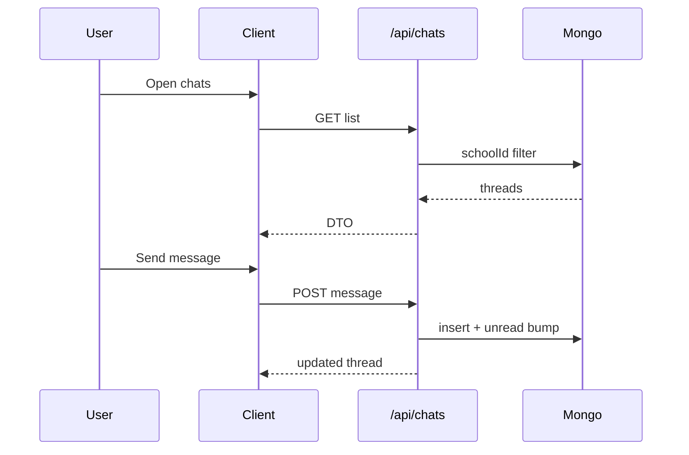

---

### 6.5 Homework

**Functionality**

- List homework with due dates / status
- Teachers / principal **create**; family updates status
- Overdue highlighting
- Appears in home feed / notifications

---

### 6.6 Circulars & notifications

**Functionality**

- Staff publish circulars (notices)
- Publish fans out **notifications**
- Users list / mark-read notifications
- Circulars readable in app; ERP overview may show read-only list

---

### 6.7 Attendance (teacher day sheet)

**Functionality**

- Class desk roster for the day
- Marks: **P** (present), **A** (absent), **L** (leave), **H** (half), **T** (late) where supported
- Personal attendance calendar for family
- Admin / ERP attendance reports / CSV (ERP)

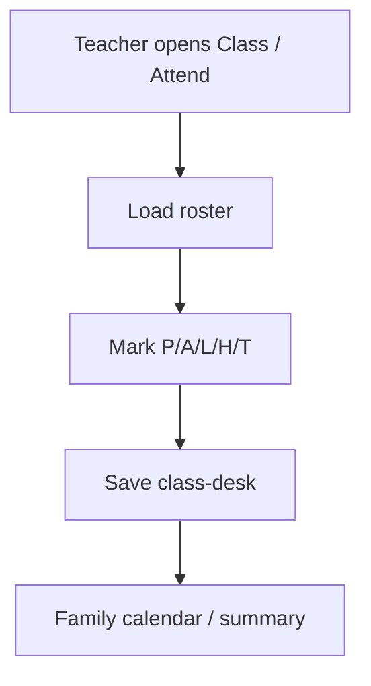

---

### 6.8 Leaves ↔ attendance

**Functionality**

- Family / staff apply leave (date range + reason)
- Staff / ERP approve or reject
- **Approve:** write **L** on ClassDesk for weekdays in range
- **Reject:** clear leave marks where applicable
- Leave-safe “mark all” so teachers do not overwrite L carelessly

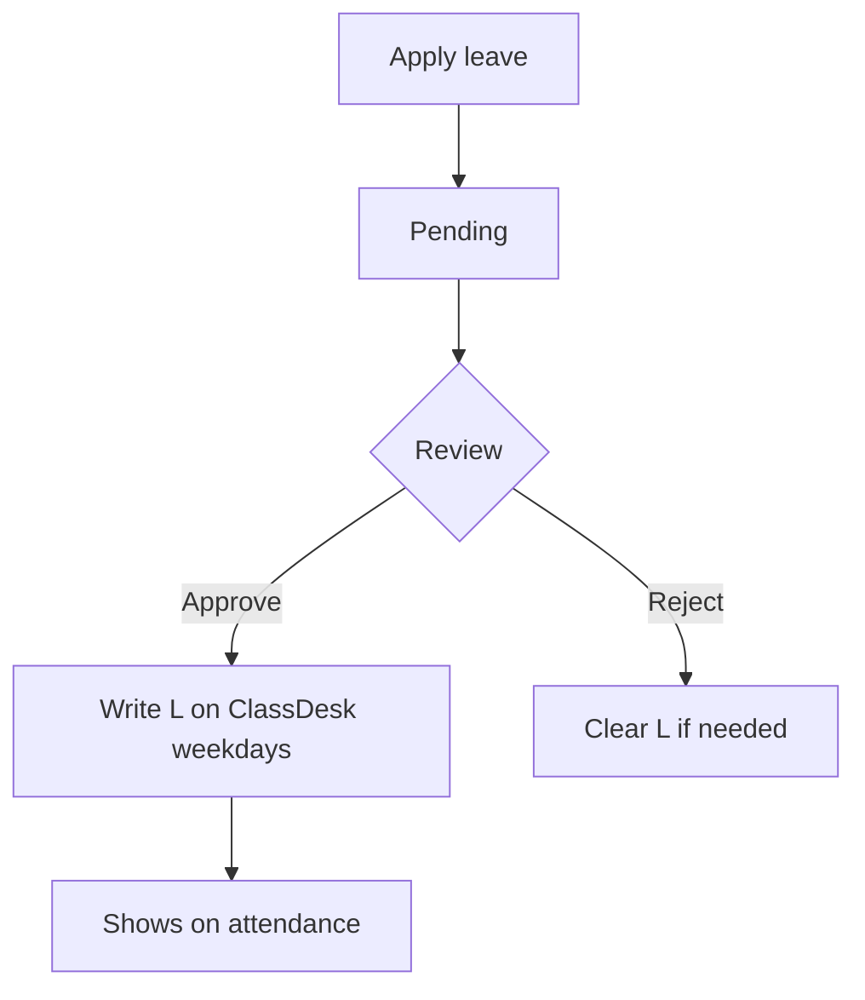

---

### 6.9 Bus tracking

**Functionality**

- Route, stops, ETA to home stop
- Alerts at **10 min** and **5 min** (user prefs)
- Bus attendant (and elevated roles) update progress
- Family read-only map / ETA UI

```mermaid
flowchart LR
  Att[Attendant updates stop progress] --> API[/api/bus]
  API --> Fam[Parent/Student ETA + alerts]
```

---

### 6.10 Fees (module-gated)

**Functionality**

- **Connect:** Fees UI hidden (`capabilities.fees` false by default)
- **ERP:** Fee structures / invoices in `/erp`; family sees ledger + **demo Pay**
- FeeAccount is family-facing balance; structures/invoices owned by ERP

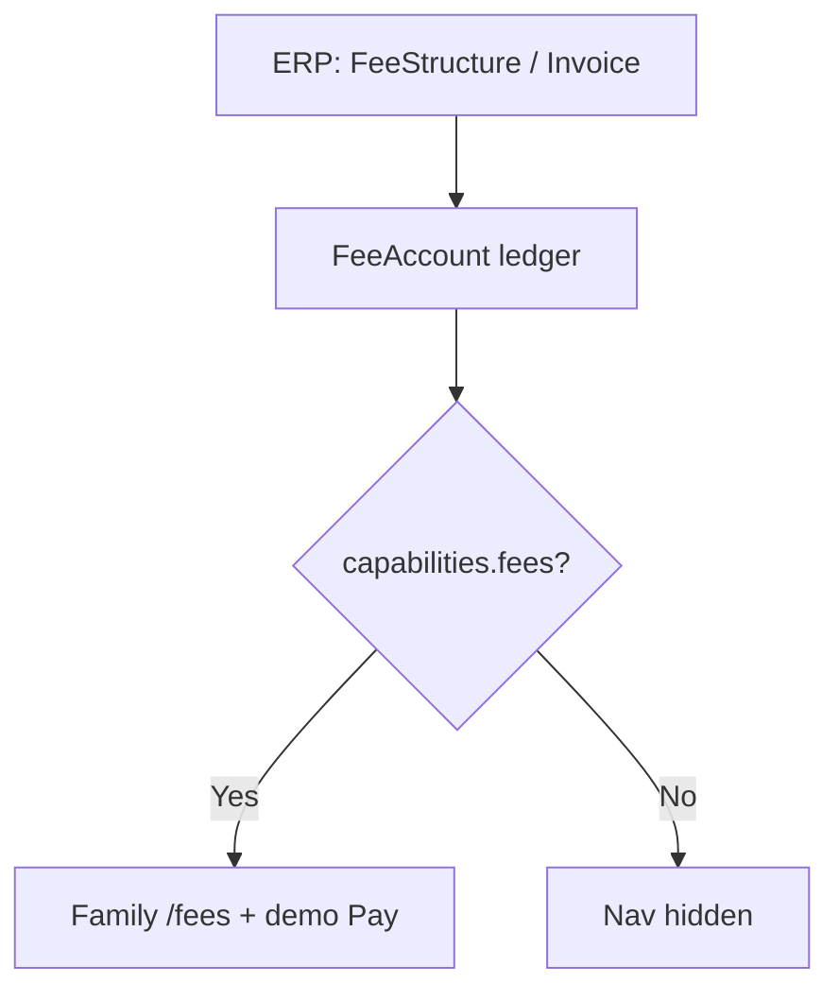

---

### 6.11 Learning Zone (`/engage`)

**Functionality**

- Family XP, streaks, missions, mood, challenges
- Server-side XP mutations
- Parent and student share Zone surface

---

### 6.12 AI assistant

**Functionality**

- In-app Q&A (`/ai`)
- Rule-based stub today; not a substitute for official circulars
- Future: LLM behind env flag ([BACKLOG.md](./BACKLOG.md))

---

### 6.13 Light School Admin (`/admin`)

**Functionality**

| Area | Behavior |
|------|----------|
| Users | Directory; role changes (Super Admin can assign Super Admin) |
| Invites | Teacher invite codes |
| Enroll | Approve / manage enrollments |
| Sessions | Soft academic session controls |
| Promotions | Annual grade promotion |
| Schools | Super Admin activate / pause |
| Attendance | Leave / mark report view |
| ERP link | Shown only if `canAccessErpConsole` |

---

### 6.14 Full ERP desktop (`/erp`) — ERP mode only

**Functionality**

| Module | What users can do |
|--------|-------------------|
| Dashboard | School ops snapshot |
| Schools | Create / edit; **productMode**, `groupCode`, `transferPolicy`, **subscription end date**, `settings.modules` (Super Admin) |
| Students | SIS CRUD; **CSV import/export** (upsert by `admissionNo`); syncs ClassDesk roster |
| Staff / teachers | StaffProfile MDM; **CSV import/export** (upsert by `employeeId`); login directory + invites still separate |
| Classes | Sections / class master |
| Timetable | Periods / timetable stub (`/erp/timetable`) |
| Subjects | Subject master |
| Admissions | Pipeline, docs checklist, interview status → enroll |
| Attendance | Reports / CSV export |
| Leaves | Review leave queue (approve → **L**) |
| Exams / Report cards | Exams, marks, printable cards |
| Fees | Structures, invoice generate, payments record |
| ID cards | Print / PDF oriented view |
| Parent links | Parent ↔ student mapping |
| Transfers | Inter-campus move desk (same API as Connect `/transfers`) |
| Sessions | Academic year / promote flows |
| Overview | Circulars / homework read-only |
| Audit | Who changed what (incl. CSV imports) |

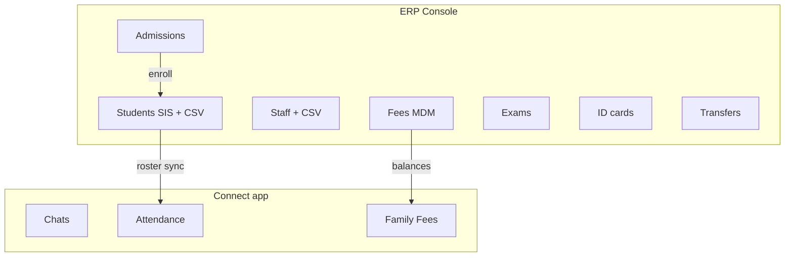

Access: [ERP.md](./ERP.md). CSV rules: [DATA-IMPORT-EXPORT.md](./DATA-IMPORT-EXPORT.md).

---

### 6.15 Profile & parent–student links

**Functionality**

- Edit name, school display, bus alert prefs, home stop
- Parents can create links to students (`/api/links`); UI manage surface still maturing
- Preferred long-term: resolve child context via link, not free-text only

---

### 6.16 Campus transfers (Connect + ERP)

**Functionality**

- School Admin / Principal create transfer request (student + destination campus + optional class)
- Destination admin **approves** or **rejects**
- **Group:** both schools share `groupCode`
- **Open intake:** destination `transferPolicy: open` allows cross-group requests
- On approve: student (and linked parent where applicable) move to dest school/class
- UI: `/transfers` (Connect) · `/erp/transfers` (ERP) · API `/api/erp/transfers`

See §4.1 and UC-11 / UC-12.

---

### 6.17 Bulk CSV — students & teachers (ERP)

**Functionality**

| Data | UI | API | Upsert key |
|------|-----|-----|------------|
| Students | `/erp/students` | `GET/POST /api/erp/students/csv` | `admissionNo` (when present) |
| Teachers / staff | `/erp/staff` | `GET/POST /api/erp/staff/csv` | `employeeId` (when present) |

- Download **template**, **export** current rows, **import** via file or paste (max 500 rows)
- UTF-8 CSV; required column: `name`
- Staff `subjects` use pipe `|` (e.g. `Math|Science`)
- Creates / updates **MDM profiles only** — does **not** create OTP login users
- Student import syncs ClassDesk roster; staff still need invite / register for app login
- Guidelines in-product + [DATA-IMPORT-EXPORT.md](./DATA-IMPORT-EXPORT.md)

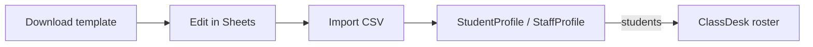

---

### 6.18 Module capability overrides

**Functionality**

- Per-school `settings.modules` can turn modules on/off (e.g. `fees: false`, `bus: false`) regardless of Connect/ERP defaults
- Clients hide nav / APIs respect `capabilities` from `/api/me`
- Super Admin edits on `/erp/schools`

---

### 6.19 Mobile Family MVP (`apps/mobile`)

**Functionality**

- React Native app for family flows: auth, home, chats, homework, attendance, bus, fees (when capability on), notifications, profile
- Same Next.js `/api` with **Bearer** JWT (token storage on device)
- Parity goal with PhoneShell family surface; staff/ERP remain web-first

Details: [MOBILE.md](./MOBILE.md).

---

## 7. End-to-end flows (diagrams)

### 7.1 School onboarding

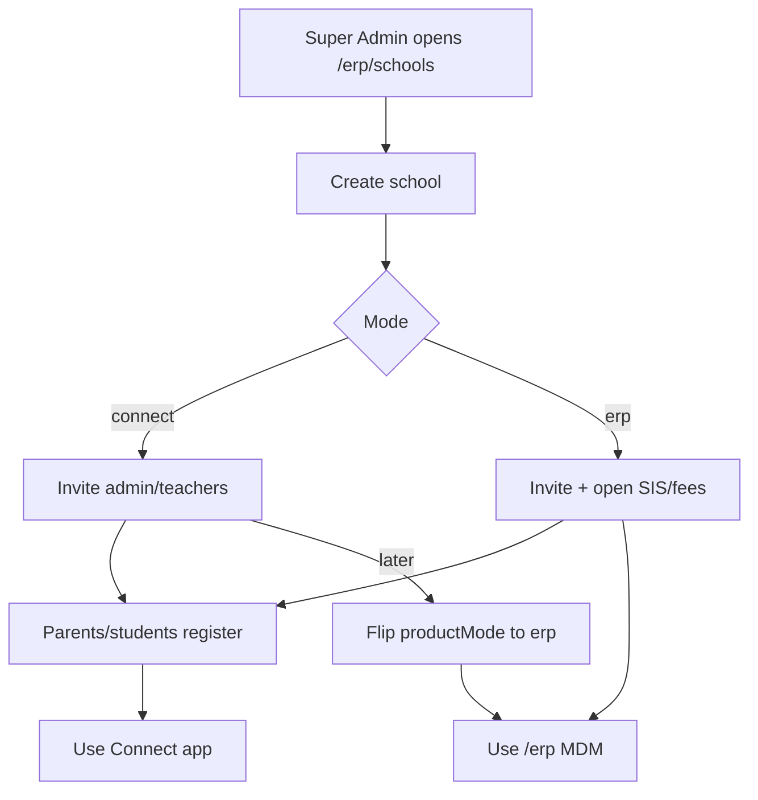

### 7.2 Teacher morning attendance

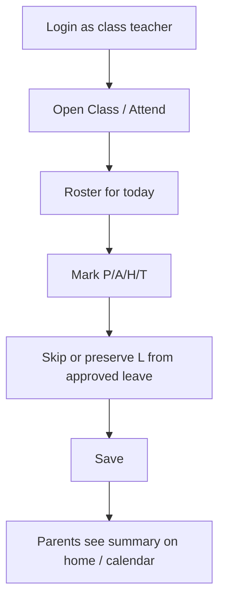

### 7.3 Parent leave request

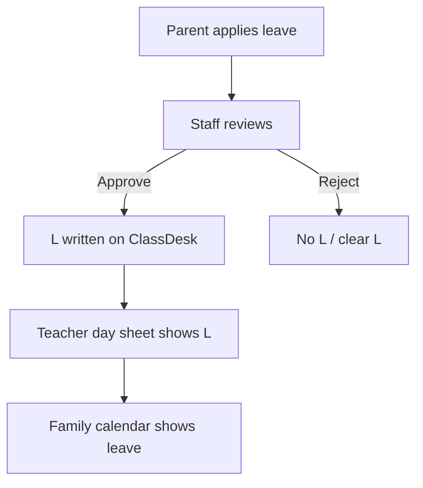

### 7.4 ERP fee to family pay

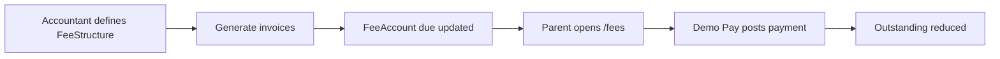

### 7.5 Campus transfer approve

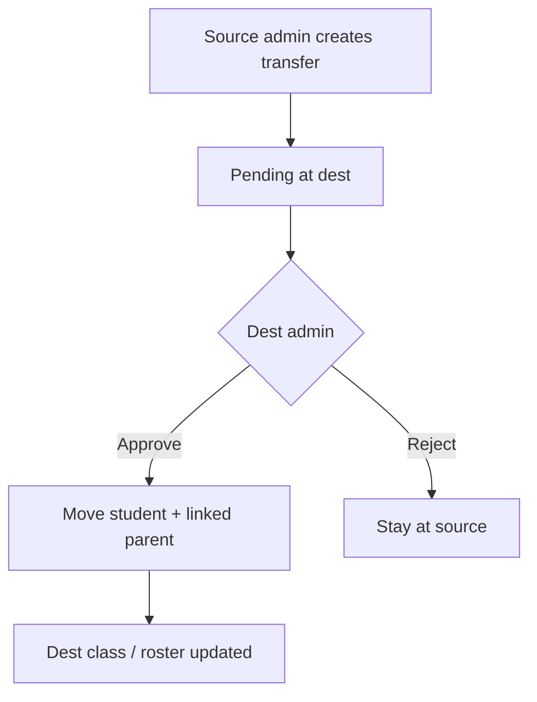

### 7.6 ERP CSV bulk load

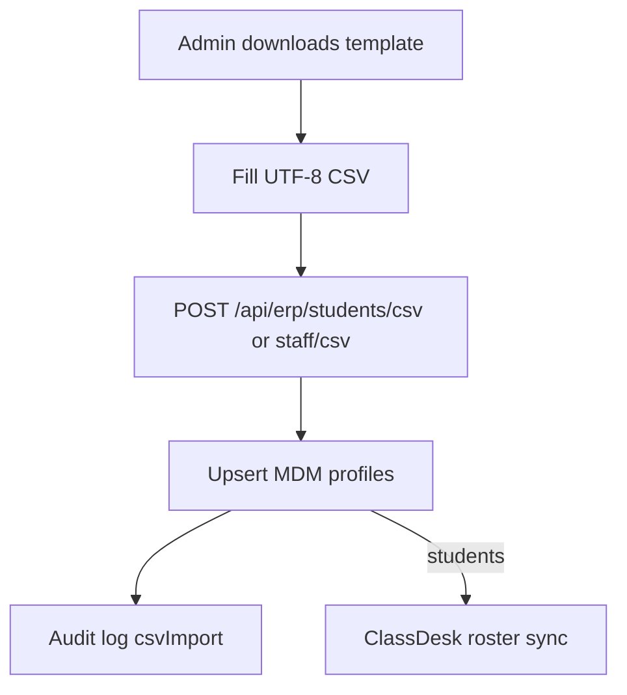

---

## 8. Non-functional requirements

| Area | Requirement |
|------|-------------|
| Multi-tenancy | All school data filtered by `schoolId` |
| Security | JWT; no secrets in `NEXT_PUBLIC_*`; role gates on mutating APIs |
| Clients | Web PhoneShell + RN Family MVP + ERP desktop |
| Availability | Single Next.js deploy serves UI + API |
| Observability | ERP audit log for MDM actions |
| i18n | Hindi/English planned (backlog) |
| Payments | Family demo Pay; school plan is free/paid **date flag** only (no gateway billing) |
| Auth honesty | Demo OTP local; Firebase SMS on backlog |
| Subscription | Default free 365 days; Super Admin extends `subscriptionExpiresAt` |

---

## 9. Use cases

### UC-01 — Super Admin onboards a Connect school

| | |
|--|--|
| **Actor** | Super Admin |
| **Precondition** | Logged in; ERP console available to Super Admin |
| **Main flow** | 1. Open `/erp/schools` 2. Create school with `productMode: connect` 3. Activate school 4. Invite School Admin |
| **Postcondition** | School uses Connect app only; `/erp` MDM blocked for school staff |
| **Alt** | Create as `erp` for full MDM from day one |

### UC-02 — Parent daily check-in

| | |
|--|--|
| **Actor** | Parent |
| **Precondition** | Approved enrollment; school linked |
| **Main flow** | 1. Open Home 2. See attendance / homework / bus ETA 3. Open Chats for class updates 4. Optional: Zone, Fees (if ERP) |
| **Postcondition** | Parent informed without WhatsApp group noise |

### UC-03 — Teacher marks attendance with leave safety

| | |
|--|--|
| **Actor** | Class Teacher |
| **Precondition** | Class desk roster loaded |
| **Main flow** | 1. Open Attend 2. Approved leaves already show **L** 3. Mark remaining students 4. Save |
| **Postcondition** | Day sheet persisted; family summaries update |

### UC-04 — Approve leave writes L

| | |
|--|--|
| **Actor** | Teacher / Admin / ERP reviewer |
| **Precondition** | Pending leave exists |
| **Main flow** | 1. Open leave 2. Approve 3. System marks **L** on weekdays in range |
| **Postcondition** | Attendance calendar and class desk consistent |
| **Alt** | Reject → clear L marks |

### UC-05 — Upgrade school Connect → ERP

| | |
|--|--|
| **Actor** | Super Admin |
| **Precondition** | School exists as `connect` |
| **Main flow** | 1. `/erp/schools` 2. Set `productMode` to `erp` 3. Admin opens `/erp` |
| **Postcondition** | MDM unlocked; no data migration required |

### UC-06 — Publish circular

| | |
|--|--|
| **Actor** | Teacher / Admin |
| **Main flow** | 1. Publish circular 2. Notification fan-out 3. Family reads in Notifications / Circulars |
| **Postcondition** | Unread notification for recipients |

### UC-07 — Bus ETA alert

| | |
|--|--|
| **Actor** | Bus Attendant + Parent |
| **Main flow** | 1. Attendant advances route progress 2. ETA recalculated 3. At 10/5 min thresholds parent alert prefs apply |
| **Postcondition** | Parent prepared for pickup |

### UC-08 — ERP admission to roster

| | |
|--|--|
| **Actor** | School Admin (ERP mode) |
| **Main flow** | 1. Create admission application 2. Complete docs checklist 3. Enroll / sync StudentProfile 4. Class desk roster updates |
| **Postcondition** | Teacher can mark attendance for new student |

### UC-09 — Family pays fees (demo)

| | |
|--|--|
| **Actor** | Parent (ERP school) |
| **Precondition** | `capabilities.fees` true; outstanding balance |
| **Main flow** | 1. Open Fees 2. Pay now (demo) 3. Ledger updates |
| **Postcondition** | Outstanding reduced; not a real gateway settlement |

### UC-10 — Student pending until approved

| | |
|--|--|
| **Actor** | Student + Teacher/Admin |
| **Main flow** | 1. Student registers 2. Sees `/pending` only 3. Staff approves enrollment 4. Full nav unlocks |
| **Postcondition** | Student has full Connect access |

### UC-11 — Group campus transfer (Connect or ERP)

| | |
|--|--|
| **Actor** | Source School Admin → Destination School Admin |
| **Precondition** | Both campuses share `groupCode` |
| **Main flow** | 1. Source opens `/transfers` or `/erp/transfers` 2. Select student + dest campus 3. Dest admin Approves 4. Student (and linked parent) move |
| **Postcondition** | Student enrolled at destination class |

### UC-12 — Cross-group transfer (open intake)

| | |
|--|--|
| **Actor** | Source admin → Destination admin (`transferPolicy: open`) |
| **Precondition** | Dest campus allows open intake |
| **Main flow** | Same as UC-11; not same group |
| **Postcondition** | Student joins external campus |

### UC-13 — Extend free subscription

| | |
|--|--|
| **Actor** | Super Admin |
| **Main flow** | 1. `/erp/schools` 2. Edit **Sub ends** date 3. School stays / becomes active again |
| **Postcondition** | `subscriptionActive` true; ERP APIs work for ERP schools |

### UC-14 — Bulk import students or teachers (CSV)

| | |
|--|--|
| **Actor** | School Admin / Principal (ERP mode, active subscription) |
| **Precondition** | School `productMode: erp`; templates available on `/erp/students` or `/erp/staff` |
| **Main flow** | 1. Download template (or Export) 2. Fill rows in Sheets → CSV UTF-8 3. Choose file or paste 4. Import CSV 5. Confirm counts / row warnings |
| **Postcondition** | Profiles upserted; students appear on ClassDesk; staff profiles listed (logins still via invite) |
| **Alt** | Missing `name` → row skipped with error; >500 rows → only first 500 processed |

---

## 10. FAQs

**Q1. Connect और ERP अलग-अलग products / databases हैं?**  
नहीं। एक monorepo, एक MongoDB, एक API। Mode **per school** (`productMode`) है। साथ में campus type (single / group) अलग axis है।

**Q2. Connect school `/erp` क्यों नहीं खोल पाता?**  
API `requireErpUser` और UI `ErpShell` school mode चेक करते हैं। Super Admin onboarding के लिए exempt है। Transfers Connect पर `/transfers` से चलते हैं।

**Q3. Connect से ERP upgrade पर data migrate करना पड़ता है?**  
नहीं। Flag flip से MDM screens unlock होते हैं; existing users/chats/attendance वहीं रहते हैं।

**Q4. Fees Connect में क्यों नहीं दिखती?**  
Default Connect capabilities में `fees: false`। ERP mode में fees on; branch `settings.modules` से override भी हो सकता है।

**Q5. Parent और Student का UI अलग है?**  
लगभग same family surface (Zone सहित)। Parent child framing / links; student enrollment pending हो सकता है।

**Q6. Demo OTP क्या है?**  
Local/demo में अक्सर `000000`। Production में Firebase SMS backlog पर है — demo OTP बंद रखें।

**Q7. Mobile अलग backend use करता है?**  
नहीं। वही Next.js `/api`; mobile Bearer JWT भेजता है।

**Q8. Leave approve से attendance कैसे जुड़ती है?**  
Approve → ClassDesk पर date range के weekdays पर **L**। Reject → L साफ़।

**Q9. Group transfer vs cross-group?**  
Same `groupCode` = group transfer। Cross-group तभी जब destination `transferPolicy: open` हो; dest admin approve करता है।

**Q10. Subscription / billing क्या है?**  
अभी gateway नहीं। हर school free ~1 year (`subscriptionExpiresAt`)। Super Admin end date बढ़ा सकता है। Expiry पर ERP APIs 403।

**Q11. AI official circular की जगह ले सकता है?**  
नहीं। Rule stub है; official notices circulars/notifications से आते हैं।

**Q12. Demo accounts कहाँ हैं?**  
Root [README Demo accounts](../README.md#demo-accounts) — सभी 4 matrix combos + legacy Green Valley।

**Q13. Students / teachers CSV से login बन जाता है?**  
नहीं। CSV सिर्फ **StudentProfile / StaffProfile** MDM। Teachers को invite + OTP register चाहिए; parents अलग से link होते हैं। गाइड: [DATA-IMPORT-EXPORT.md](./DATA-IMPORT-EXPORT.md).

**Q14. Architecture / code layout कहाँ पढ़ें?**  
[ARCHITECTURE.md](./ARCHITECTURE.md) (monorepo, providers, `/api/v1`) · [BACKEND.md](./BACKEND.md) (routes/models) · setup: [Root README](../README.md).

---

## 11. Document control

| Version | Notes |
|---------|--------|
| 1.0 | Initial BRD: modes, features, flows, use cases, FAQs |
| 1.1 | Campus matrix, transfers (group/open), module overrides, free 1-year subscription, UC-11–13 |
| 1.2 | ERP module table completeness (transfers, timetable, schools flags); **student & teacher CSV** (§6.17, UC-14); module overrides & mobile (§6.18–6.19); architecture pointer in §5; FAQ Q13–Q14 |

*Engineering:* [ARCHITECTURE.md](./ARCHITECTURE.md) · [BACKEND.md](./BACKEND.md). *CSV:* [DATA-IMPORT-EXPORT.md](./DATA-IMPORT-EXPORT.md). *Modes:* [PRODUCT-MODES.md](./PRODUCT-MODES.md). *Roles:* [ROLES-AND-FEATURES.md](./ROLES-AND-FEATURES.md). *ERP:* [ERP.md](./ERP.md).
