# SchoolConnect AI — Complete Routes, UI/UX & Feature Architecture Guide

> **Purpose:** This document is the single source of truth for all **38 frontend routes and pages** in SchoolConnect AI. It details every screen's **purpose, target roles, UI layout, components, interactive actions, data flow, inbound/outbound links, and UI/UX re-design/theming guide**.  
> Use this guide to easily redesign, restyle, re-theme, or build on top of any page without breaking functionality or business logic.

---

## Table of Contents

1. [Design System & Theming Architecture](#1-design-system--theming-architecture)
   - 1.1 [Dual Shell Architecture: PhoneShell vs. ErpShell](#11-dual-shell-architecture-phoneshell-vs-erpshell)
   - 1.2 [Global CSS Variables & Color Tokens](#12-global-css-variables--color-tokens)
   - 1.3 [Typography, Elevation & Animation Tokens](#13-typography-elevation--animation-tokens)
   - 1.4 [How to Re-Theme the Application](#14-how-to-re-theme-the-application)
2. [Visual Route Sitemap](#2-visual-route-sitemap)
3. [Master Route Quick Reference Table](#3-master-route-quick-reference-table)
4. [Part I: Mobile / Connect App Routes (`PhoneShell`)](#4-part-i-mobile--connect-app-routes-phoneshell)
   - 4.1 [`/` — Dynamic Home / Daily Activity Hub](#41---dynamic-home--daily-activity-hub)
   - 4.2 [`/auth` — Multi-Step Authentication & Onboarding](#42-auth--multi-step-authentication--onboarding)
   - 4.3 [`/pending` — Verification & School Link Safety Gate](#43-pending--verification--school-link-safety-gate)
   - 4.4 [`/profile` — User Account, Leaves & Linked Students](#44-profile--user-account-leaves--linked-students)
   - 4.5 [`/more` — Modular Navigation Directory](#45-more--modular-navigation-directory)
   - 4.6 [`/notifications` — Notification Alerts & Deep-Link Center](#46-notifications--notification-alerts--deep-link-center)
   - 4.7 [`/chats` — Messaging Inbox & Channel Directory](#47-chats--messaging-inbox--channel-directory)
   - 4.8 [`/chats/[id]` — Conversation Room & Media Composer](#48-chatsid--conversation-room--media-composer)
   - 4.9 [`/circulars` — Official Notices, Circulars & Announcements](#49-circulars--official-notices-circulars--announcements)
   - 4.10 [`/homework` — Homework Feed, Tracker & Teacher Desk](#410-homework--homework-feed-tracker--teacher-desk)
   - 4.11 [`/attendance` — Attendance Calendar & Leave Requests](#411-attendance--attendance-calendar--leave-requests)
   - 4.12 [`/class` — Teacher Class Operations Desk](#412-class--teacher-class-operations-desk)
   - 4.13 [`/bus` — Live GPS Bus Tracker & Stops Drawer](#413-bus--live-gps-bus-tracker--stops-drawer)
   - 4.14 [`/fees` — Parent Fee Dues, Receipts & Online Pay](#414-fees--parent-fee-dues-receipts--online-pay)
   - 4.15 [`/engage` — Learning Zone, Gamification XP & Mood Tracker](#415-engage--learning-zone-gamification-xp--mood-tracker)
   - 4.16 [`/ai` — SchoolConnect AI Chat Assistant](#416-ai--schoolconnect-ai-chat-assistant)
   - 4.17 [`/report` — Academic Report Card & Promotion History](#417-report--academic-report-card--promotion-history)
   - 4.18 [`/transfers` — Campus Transfer Desk (Connect Mode)](#418-transfers--campus-transfer-desk-connect-mode)
   - 4.19 [`/admin` — Mobile School Admin Console](#419-admin--mobile-school-admin-console)
5. [Part II: Desktop ERP Management Console (`ErpShell`)](#5-part-ii-desktop-erp-management-console-erpshell)
   - 5.1 [`/erp` — Executive Operations Dashboard](#51-erp--executive-operations-dashboard)
   - 5.2 [`/erp/overview` — Operations Circulars & Homework Oversight](#52-erpoverview--operations-circulars--homework-oversight)
   - 5.3 [`/erp/admissions` — Student Admissions Pipeline](#53-erpadmissions--student-admissions-pipeline)
   - 5.4 [`/erp/students` — Student Information System (SIS)](#54-erpstudents--student-information-system-sis)
   - 5.5 [`/erp/staff` — Faculty & Staff HR Directory](#55-erpstaff--faculty--staff-hr-directory)
   - 5.6 [`/erp/classes` — Class & Section Management](#56-erpclasses--class--section-management)
   - 5.7 [`/erp/subjects` — Subject Catalog & Credits](#57-erpsubjects--subject-catalog--credits)
   - 5.8 [`/erp/timetable` — Weekly Schedule & Period Matrix](#58-erptimetable--weekly-schedule--period-matrix)
   - 5.9 [`/erp/attendance` — School-Wide Attendance Registers & Analytics](#59-erpattendance--school-wide-attendance-registers--analytics)
   - 5.10 [`/erp/exams` — Exam Schedules & Marks Entry](#510-erpexams--exam-schedules--marks-entry)
   - 5.11 [`/erp/report-cards` — Bulk Report Card Studio & Printing](#511-erpreport-cards--bulk-report-card-studio--printing)
   - 5.12 [`/erp/fees` — Fee Structures, Cashier & Dues](#512-erpfees--fee-structures-cashier--dues)
   - 5.13 [`/erp/leaves` — Central Leave Approval Console](#513-erpleaves--central-leave-approval-console)
   - 5.14 [`/erp/id-cards` — Printable ID Card Studio](#514-erpid-cards--printable-id-card-studio)
   - 5.15 [`/erp/schools` — Multi-Campus & License Management](#515-erpschools--multi-campus--license-management)
   - 5.16 [`/erp/sessions` — Academic Sessions & Term Setup](#516-erpsessions--academic-sessions--term-setup)
   - 5.17 [`/erp/transfers` — Campus Transfer Authority Console](#517-erptransfers--campus-transfer-authority-console)
   - 5.18 [`/erp/links` — Parent-Student Relationship Manager](#518-erplinks--parent-student-relationship-manager)
   - 5.19 [`/erp/audit` — System Mutation & Security Audit Logs](#519-erpaudit--system-mutation--security-audit-logs)
6. [Best Practices for Customizing UI/UX](#6-best-practices-for-customizing-uiux)

---

## 1. Design System & Theming Architecture

SchoolConnect AI uses **Vanilla CSS** coupled with CSS Custom Properties (variables) defined in [`apps/web/src/app/globals.css`](file:///c:/Users/devra/Desktop/Radoms_Project/SchoolConnect/schoolconnectAI/apps/web/src/app/globals.css).

### 1.1 Dual Shell Architecture: PhoneShell vs. ErpShell

The application provides two complementary user experiences:

```
                               ┌─────────────────────────┐
                               │       Application       │
                               └────────────┬────────────┘
                                            │
                    ┌───────────────────────┴───────────────────────┐
                    ▼                                               ▼
         ┌─────────────────────┐                         ┌─────────────────────┐
         │     PhoneShell      │                         │      ErpShell       │
         │  (Mobile / Connect) │                         │    (Desktop ERP)    │
         ├─────────────────────┤                         ├─────────────────────┤
         │ • Mobile viewport   │                         │ • Full desktop wide │
         │ • Centered 440px max│                         │ • Collapsible Nav   │
         │ • Sticky Topbar     │                         │ • Dark Sidebar      │
         │ • Floating Nav Bar  │                         │ • Data Tables/Grids │
         │ • Touch Gestures    │                         │ • Bulk Import/Export│
         │ • Card/Feed layout  │                         │ • Modals & Drawers  │
         └─────────────────────┘                         └─────────────────────┘
```

1. **`PhoneShell`** ([`PhoneShell.tsx`](file:///c:/Users/devra/Desktop/Radoms_Project/SchoolConnect/schoolconnectAI/apps/web/src/components/shell/PhoneShell.tsx)):
   - **Target audience:** Parents, Students, Teachers, Bus Attendants, and School Admins on mobile devices.
   - **Form factor:** Styled to look and feel like an iOS/Android native mobile application (`max-width: 440px` centered on wide viewports, 100% width on mobile).
   - **Structure:**
     - `header.header-primary` / `header.header-plain`: Sticky glassmorphic header with user initials, school name, notification bell icon, and title.
     - `main.page-main`: Scrollable card stream with safe-area padding (`safe-top`, `safe-bottom`).
     - `nav.bottom-nav`: Floating glassmorphic dock with role-based navigation icons and unread badge counters.

2. **`ErpShell`** ([`ErpShell.tsx`](file:///c:/Users/devra/Desktop/Radoms_Project/SchoolConnect/schoolconnectAI/apps/web/src/components/erp/ErpShell.tsx)):
   - **Target audience:** School Principals, Administrators, Accountants, Office Staff, and Super Admins on desktop computers.
   - **Form factor:** Responsive full-width dashboard layout with fixed high-density sidebar (`aside.erp-sidebar`) and fluid content canvas (`main.erp-main`).
   - **Structure:**
     - Left Sidebar: Campus branding, status beacon, 4 grouped navigation sections, user card, and sign out button.
     - Top Bar: Page breadcrumbs, active academic session badge, school switcher, and search.
     - Content Canvas: Data tables, stat grids, filter bars, CSV uploaders, and slide-over sidebars.

---

### 1.2 Global CSS Variables & Color Tokens

All design tokens are defined on `:root` in [`globals.css`](file:///c:/Users/devra/Desktop/Radoms_Project/SchoolConnect/schoolconnectAI/apps/web/src/app/globals.css#L1-L93):

| Token Name | Value | Semantic Usage |
| :--- | :--- | :--- |
| `--primary` | `#7C5CFC` (Lavender Violet) | Primary brand color, main call-to-action buttons, active tab indicators |
| `--primary-dark` | `#5B3FE0` | Hover states, active pressed states, avatar background gradients |
| `--primary-soft` | `#E7E0FF` | Tinted icon containers, active pill backgrounds |
| `--accent` | `#FF7A45` (Warm Tangerine) | High-contrast callouts, unread chat badges, bus route highlights |
| `--accent-dark` | `#E85F2A` | Accent hover state |
| `--accent-soft` | `#FFE6D6` | Tangerine icon backgrounds, fee notice tags |
| `--success` | `#22C55E` (Emerald) | Attendance present, fees paid, verified status |
| `--success-soft` | `#DEFBE8` | Soft green badge background, attendance summary |
| `--warning` | `#F5A524` (Warm Amber) | Attendance half-day, pending tasks, streak counters |
| `--warning-soft` | `#FFF3D9` | Amber badge background |
| `--danger` | `#F0466E` (Rose Coral) | Attendance absent, overdue tasks, sign out danger rows |
| `--danger-soft` | `#FEE1EA` | Coral badge background |
| `--info` | `#3B9EFF` (Sky Blue) | Attendance approved leave, homework math tags, notifications |
| `--info-soft` | `#DFEEFF` | Blue badge background |
| `--nav-dark` | `#1D1832` (Deep Navy) | Contrast floating capsule bottom navigation dock |
| `--bg` | `#F5F2FE` (Warm Tint) | Main body canvas background with lavender radial gradient |
| `--surface` | `#FFFFFF` | Card surfaces, modal surfaces, floating panels |
| `--surface-tint` | `#EFE8FF` | Tinted card backgrounds, calendar blank days |
| `--ink` | `#241B3D` (Deep Navy) | Primary high-contrast text color |
| `--ink-soft` | `#786F94` (Muted Slate) | Subtitle text, timestamps, secondary metadata |
| `--line` / `--border`| `#ECE7FA` | Subtle hairline borders between cards and table cells |
| `--glass-bg` | `rgba(255, 255, 255, 0.88)` | Glassmorphic floating bars and headers |
| `--glass-border` | `rgba(236, 231, 250, 0.75)` | Glass container borders |

---

### 1.3 Typography, Elevation & Animation Tokens

- **Fonts:**
  - Headings, Numbers & Greetings: **`Fredoka`** (`--font-display`), weights `500`, `600`, `700`. Gives a friendly, approachable, modern educational warmth.
  - Body, Forms & UI Data: **`Plus Jakarta Sans`** (`--font-sans`, `--font-body`), weights `400`, `500`, `600`, `700`, `800`. Clean, geometric, and highly readable on all screen sizes.
- **Card Radii:**
  - Standard Cards: `--radius-card: 22px`
  - Action Buttons & Inputs: `--radius-btn: 16px`
  - Chips & Dock Pills: `--radius-chip: 999px`
- **Shadow System:**
  - `--shadow-card`: `0 10px 28px -10px rgba(124, 92, 252, 0.28), 0 2px 8px rgba(36, 27, 61, 0.05)` (soft lavender tinted elevation)
  - `--shadow-pop`: `0 14px 28px -8px rgba(255, 122, 69, 0.45)` (glow effect on tangerine primary CTA)
  - `--shadow-nav`: `0 20px 44px -14px rgba(20, 15, 40, 0.55)` (deep shadow lifting the floating capsule nav)

---

### 1.4 How to Re-Theme the Application

To customize the visual theme:
1. **Change Brand Colors in `:root`**: Update `--primary`, `--primary-dark`, `--primary-soft`, `--accent`, `--accent-soft` in [`globals.css`](file:///c:/Users/devra/Desktop/Radoms_Project/SchoolConnect/schoolconnectAI/apps/web/src/app/globals.css#L1-L93).
2. **Typography Pairing**: Change `--font-display` (e.g. to `Fredoka`, `Nunito Sans`, or `Outfit`) and `--font-sans` (e.g. to `Plus Jakarta Sans` or `Inter`).
3. **Card Radii**: Adjust `--radius-card` (`22px` for modern friendly cards, `14px` for compact corporate).
4. **Bottom Dock**: The capsule dock is controlled via `.bottom-nav-inner` with `background: var(--nav-dark)`.

---

## 2. Visual Route Sitemap

```mermaid
flowchart TB
    subgraph Public["1. Auth & Safety Gate"]
        AUTH["/auth<br>(Login, OTP, Signup, Demo Users)"]
        PENDING["/pending<br>(School Link & Approval Gate)"]
    end

    subgraph CoreMobile["2. Mobile Connect Hub (PhoneShell)"]
        HOME["/<br>(Dynamic Role Dashboard)"]
        CHATS["/chats<br>(Message Threads)"]
        CHAT_ROOM["/chats/[id]<br>(Conversation Room)"]
        HW["/homework<br>(Assignments & Submissions)"]
        CIRC["/circulars<br>(Notices & Urgent Announcements)"]
        ATT["/attendance<br>(Calendar, Stats & Leaves)"]
        CLASS["/class<br>(Teacher Desk & Roll Call)"]
        BUS["/bus<br>(Live GPS Map & Stops)"]
        FEES["/fees<br>(Dues & Online Payment)"]
        ENGAGE["/engage<br>(Learning Zone, XP & Mood)"]
        AI["/ai<br>(AI Assistant Chatbot)"]
        REPORT["/report<br>(Academic Progress & Grades)"]
        PROFILE["/profile<br>(Account, Leave Form, Children)"]
        NOTIF["/notifications<br>(Alerts & Deep-Links)"]
        MORE["/more<br>(Navigation Grid)"]
        TRANSFERS_M["/transfers<br>(Campus Transfer Desk)"]
        ADMIN_M["/admin<br>(Mobile School Admin)"]
    end

    subgraph DesktopERP["3. Management Console (ErpShell)"]
        ERP_DASH["/erp<br>(Executive Ops Dashboard)"]
        ERP_OVERVIEW["/erp/overview<br>(Homework & Circulars)"]
        ERP_ADM["/erp/admissions<br>(Admissions Pipeline)"]
        ERP_STUDENTS["/erp/students<br>(Student SIS & CSV)"]
        ERP_STAFF["/erp/staff<br>(Faculty & HR Directory)"]
        ERP_CLASSES["/erp/classes<br>(Grade & Section Config)"]
        ERP_SUBJECTS["/erp/subjects<br>(Subject Catalog & Credits)"]
        ERP_TIMETABLE["/erp/timetable<br>(Period Matrix Scheduler)"]
        ERP_ATT["/erp/attendance<br>(School Registers & Stats)"]
        ERP_EXAMS["/erp/exams<br>(Exams & Marks Entry)"]
        ERP_REPORT_CARDS["/erp/report-cards<br>(Bulk PDF Cards)"]
        ERP_FEES["/erp/fees<br>(Fee Heads, Dues & Vouchers)"]
        ERP_LEAVES["/erp/leaves<br>(Central Leave Approvals)"]
        ERP_ID["/erp/id-cards<br>(ID Card Print Studio)"]
        ERP_SCHOOLS["/erp/schools<br>(Campuses & Licensing)"]
        ERP_SESSIONS["/erp/sessions<br>(Academic Years & Terms)"]
        ERP_TRANSFERS["/erp/transfers<br>(Inter-Branch Transfers)"]
        ERP_LINKS["/erp/links<br>(Parent-Student Linker)"]
        ERP_AUDIT["/erp/audit<br>(Mutation & Audit Logs)"]
    end

    AUTH -->|After OTP/Signup| PENDING
    PENDING -->|Approved| HOME
    AUTH -->|Demo Logins| HOME

    HOME --> CHATS
    HOME --> HW
    HOME --> CIRC
    HOME --> ATT
    HOME --> BUS
    HOME --> FEES
    HOME --> ENGAGE
    HOME --> AI
    HOME --> REPORT
    HOME --> MORE
    HOME --> NOTIF
    HOME --> PROFILE

    CHATS --> CHAT_ROOM
    HOME -->|Teacher Role| CLASS
    HOME -->|Admin Role| ADMIN_M
    ADMIN_M -->|Full ERP Upgrade| ERP_DASH

    ERP_DASH --> ERP_STUDENTS
    ERP_DASH --> ERP_CLASSES
    ERP_DASH --> ERP_STAFF
    ERP_DASH --> ERP_ADM
    ERP_DASH --> ERP_FEES
    ERP_DASH --> ERP_ATT
    ERP_DASH --> ERP_LEAVES
    ERP_DASH --> ERP_EXAMS
```



---

## 3. Master Route Quick Reference Table

| Route URL | Surface / Shell | Target Roles | Primary Functionality | Primary APIs / State |
| :--- | :--- | :--- | :--- | :--- |
| [`/`](#41---dynamic-home--daily-activity-hub) | `PhoneShell` | All Roles | Role-adaptive dashboard with quick actions, KPI widgets, recent feed | `/api/fees`, `/api/attendance/summary`, `/api/feed` |
| [`/auth`](#42-auth--multi-step-authentication--onboarding) | Full Screen | Public / Visitors | OTP phone/email login, role registration, school search, demo switch pills | `/api/auth/*`, `/api/schools`, `/api/invites` |
| [`/pending`](#43-pending--verification--school-link-safety-gate) | `PhoneShell` (No Nav) | Unapproved Users | Safety gate awaiting administrator/teacher approval or school linkage | `/api/enrollments/*`, `/api/auth/me` |
| [`/profile`](#44-profile--user-account-leaves--linked-students) | `PhoneShell` | All Roles | Personal settings, student-linking panel, bus alerts, leave application form & history | `/api/leaves`, `/api/links`, `/api/auth/me` |
| [`/more`](#45-more--modular-navigation-directory) | `PhoneShell` | All Roles | 3-section categorization directory linking all app capabilities | Capability inspection |
| [`/notifications`](#46-notifications--notification-alerts--deep-link-center) | `PhoneShell` | All Roles | Real-time push & system alerts with category icons and deep links | `/api/notifications`, SchoolDataProvider |
| [`/chats`](#47-chats--messaging-inbox--channel-directory) | `PhoneShell` | All Roles | WhatsApp-style conversation list, live search, unread badge pills | `/api/chats`, SchoolDataProvider |
| [`/chats/[id]`](#48-chatsid--conversation-room--media-composer) | `PhoneShell` (No Nav) | All Roles | Real-time messaging thread, homework attachments, emoji reactions | `/api/chats/[id]/messages`, WebSocket/Poll |
| [`/circulars`](#49-circulars--official-notices-circulars--announcements) | `PhoneShell` | All Roles | Official notices, filter chips (Event, Notice, PTM), teacher publishing form | `/api/circulars`, TeacherClassProvider |
| [`/homework`](#410-homework--homework-feed-tracker--teacher-desk) | `PhoneShell` | Students, Parents, Teachers | Subject-wise homework cards, status progression pill, teacher creation modal | `/api/homework`, StudentEngageProvider |
| [`/attendance`](#411-attendance--attendance-calendar--leave-requests) | `PhoneShell` | Students, Parents, Teachers | Interactive monthly attendance calendar, leave statistics, teacher review desk | `/api/attendance`, `/api/leaves` |
| [`/class`](#412-class--teacher-class-operations-desk) | `PhoneShell` | Class Teachers | Daily roll-call roster, mark all present, post daily notes, approve enrollments | `/api/class/roster`, `/api/enrollments` |
| [`/bus`](#413-bus--live-gps-bus-tracker--stops-drawer) | `PhoneShell` (No Nav) | Parents, Students, Attendants | Interactive SVG route map, live simulated GPS bus, stops timeline drawer | `/api/bus/location`, BusTrackProvider |
| [`/fees`](#414-fees--parent-fee-dues-receipts--online-pay) | `PhoneShell` | Parents, Students, Admins | Outstanding dues summary, payment gateway checkout simulation, receipt download | `/api/fees`, `/api/fees/pay` |
| [`/engage`](#415-engage--learning-zone-gamification-xp--mood-tracker) | `PhoneShell` | Students, Parents | Gamified XP circle, level streaks, daily mood tracker, focus timer, badges | StudentEngageProvider, LocalStorage |
| [`/ai`](#416-ai--schoolconnect-ai-chat-assistant) | `PhoneShell` | Parents, Students, Teachers | AI School Assistant chatbot with suggestion chips and smart KPI metric cards | `/api/ai/chat` |
| [`/report`](#417-report--academic-report-card--promotion-history) | `PhoneShell` | Parents, Students | Academic record banner, 4-corner KPI grid, term grade table, promotion log | `/api/attendance/summary`, User context |
| [`/transfers`](#418-transfers--campus-transfer-desk-connect-mode) | `PhoneShell` | Admins, Principals | Campus transfer desk for schools operating in Connect mode | `/api/transfers`, `/api/erp/schools` |
| [`/admin`](#419-admin--mobile-school-admin-console) | `PhoneShell` | Admins, Principals | Lightweight tabbed mobile admin: Users, Enrollment desk, Bulk Promotions, Sessions | `/api/admin/*`, `/api/attendance/report` |
| [`/erp`](#51-erp--executive-operations-dashboard) | `ErpShell` | ERP Admins, Principals | High-level operations cockpit with 8 KPI cards, role breakdown, and recent leaves | `/api/erp/dashboard` |
| [`/erp/overview`](#52-erpoverview--operations-circulars--homework-oversight) | `ErpShell` | ERP Admins | Combined read-only oversight of all circulars and homework assignments | `/api/erp/overview` |
| [`/erp/admissions`](#53-erpadmissions--student-admissions-pipeline) | `ErpShell` | ERP Admins | Multi-stage admission pipeline, document verification checklist, approve actions | `/api/erp/admissions`, `/api/enrollments` |
| [`/erp/students`](#54-erpstudents--student-information-system-sis) | `ErpShell` | ERP Admins | Student directory, search, profile slide-over editor, CSV bulk import/export | `/api/erp/students`, `/api/erp/students/csv` |
| [`/erp/staff`](#55-erpstaff--faculty--staff-hr-directory) | `ErpShell` | ERP Admins | Faculty and staff roster, role management, teacher subject assignment | `/api/erp/staff` |
| [`/erp/classes`](#56-erpclasses--class--section-management) | `ErpShell` | ERP Admins | Grades and sections matrix, student capacity limits, class teacher allocations | `/api/erp/classes` |
| [`/erp/subjects`](#57-erpsubjects--subject-catalog--credits) | `ErpShell` | ERP Admins | Academic subjects catalog, course codes, weekly credit hours, assigned teachers | `/api/erp/subjects` |
| [`/erp/timetable`](#58-erptimetable--weekly-schedule--period-matrix) | `ErpShell` | ERP Admins | Weekly matrix timetable builder (Monday-Saturday) across periods and rooms | `/api/erp/timetable` |
| [`/erp/attendance`](#59-erpattendance--school-wide-attendance-registers--analytics) | `ErpShell` | ERP Admins | School-wide attendance registers, class percentage rankings, monthly summaries | `/api/attendance/report`, `/api/erp/attendance` |
| [`/erp/exams`](#510-erpexams--exam-schedules--marks-entry) | `ErpShell` | ERP Admins, Teachers | Examination scheduling, maximum/passing marks, bulk student marks entry table | `/api/erp/exams` |
| [`/erp/report-cards`](#511-erpreport-cards--bulk-report-card-studio--printing) | `ErpShell` | ERP Admins | Report card builder, grade scale configuration, printable single/bulk PDF preview | `/api/erp/report-cards` |
| [`/erp/fees`](#512-erpfees--fee-structures-cashier--dues) | `ErpShell` | ERP Admins, Accountants | Fee category setup, invoice generator, cashier payment counter, dues report | `/api/erp/fees`, `/api/erp/fees/invoices` |
| [`/erp/leaves`](#513-erpleaves--central-leave-approval-console) | `ErpShell` | ERP Admins, Principals | Central leave log for all teachers, staff, and students with one-click review | `/api/erp/leaves` |
| [`/erp/id-cards`](#514-erpid-cards--printable-id-card-studio) | `ErpShell` | ERP Admins | Printable photo ID card designer with QR codes, barcode, and bulk print preview | `/api/erp/students`, Print CSS |
| [`/erp/schools`](#515-erpschools--multi-campus--license-management) | `ErpShell` | Super Admins | Campus branches manager, school license codes, Connect vs ERP mode toggles | `/api/erp/schools` |
| [`/erp/sessions`](#516-erpsessions--academic-years--terms-setup) | `ErpShell` | ERP Admins | Academic calendar sessions (e.g. 2026-27), term dates, active session switch | `/api/erp/sessions` |
| [`/erp/transfers`](#517-erptransfers--campus-transfer-authority-console) | `ErpShell` | ERP Admins | Inter-campus student migration management, transfer approvals, dossier export | `/api/erp/transfers` |
| [`/erp/links`](#518-erplinks--parent-student-relationship-manager) | `ErpShell` | ERP Admins | Family linkage manager, parent lookup, student link codes, authorization | `/api/erp/links` |
| [`/erp/audit`](#519-erpaudit--system-mutation--security-audit-logs) | `ErpShell` | Super Admins, Admins | Immutable system audit trails, user mutations, timestamped actor log | `/api/erp/audit` |

---

## 4. Part I: Mobile / Connect App Routes (`PhoneShell`)

---

### 4.1 `/` — Dynamic Home / Daily Activity Hub
- **File Location:** [`apps/web/src/app/page.tsx`](file:///c:/Users/devra/Desktop/Radoms_Project/SchoolConnect/schoolconnectAI/apps/web/src/app/page.tsx)
- **Accessible Roles:** All Authenticated Users (`parent`, `student`, `class_teacher`, `bus_attendant`, `admin`, `principal`, `super_admin`).
- **Route Guards:** If user is logged out, redirects to `/auth`. If school is not assigned or enrollment is pending, redirects to `/pending`.

#### Primary Functionality & Features
1. **Adaptive Role-Specific Hero Header:** Shows user name, student name (for parents), current school & class, role badge beacon, and level/streak indicators.
2. **Key Metric Quick Cards:**
   - **Attendance:** Displays current month's attendance percentage (`88%`, `On track`) with deep link to `/attendance`.
   - **Fees Due:** Displays pending fee balance and due date with deep link to `/fees`.
   - **Homework Status:** Displays count of pending assignments with deep link to `/homework`.
   - **Learning Zone / Class Desk:** Dynamic 4th card showing XP Level for families, or Unmarked Roll-call count for teachers.
3. **Quick Action Grid:** Fast shortcuts to Bus Tracker, Class Desk, Circulars, and AI Assistant.
4. **Activity Stream Feed:** Real-time stream of recent school events, homework posts, circular alerts, and bus notifications.

#### UI & Layout Structure
- **Container:** `<PhoneShell>` with `header.header-primary`.
- **Top Greeting & Sibling Dock (`.home-hero-card`):** Rounded container with 52px avatar, live role pill, metadata line, and sibling switcher pills for parents.
- **Friendly Hero Card (`.hero-card`):** Vibrant gradient card (`--gradient-hero`) featuring student streak indicator (`.streak-chip`: `🔥 6-day streak`) and an animated friendly mascot illustration (`.mascot`).
- **Metric Cards Grid (`.stats-grid`):** 2×2 clean grid displaying key indicators with soft-tinted icon containers:
  - Attendance: `--success-soft` icon background with percentage and health status.
  - Fees Due: `--accent-soft` icon background with rupee amount and due date.
  - Homework: `--info-soft` icon background with pending tasks count.
  - Learning Zone / Progress: `--primary-soft` icon background with Level & XP.
- **Quick Action Pills Row (`.quick-row`):** Horizontal scrollable row of 52px rounded icon pills (`.quick-pill .qicon`) for Bus, Class/Attendance, Notices, AI Buddy, and Fees.
- **Stream List (`.feed-item`):** Chronological cards with 4px left-border indicators (`--primary`, `--accent`, `--success`), soft-tinted icon boxes, title, subtitle, and timestamp.

#### Reference Links & Actions
- **Inbound:** Default landing page after login; Home icon in bottom nav.
- **Outbound:** Deep-links to `/attendance`, `/fees`, `/homework`, `/engage`, `/bus`, `/circulars`, `/class`, `/admin`, `/notifications`, `/profile`.
- **APIs Called:** `GET /api/fees`, `GET /api/attendance/summary`, `GET /api/feed`.

#### UI/UX Re-design & Theming Recommendations
- **Mascot & Gamification:** The mascot container (`.mascot`) uses CSS floating keyframes (`float 3.2s ease-in-out infinite`) with warm gradient blush and smile features, instantly welcoming students and parents.
- **2×2 Stat Grid Polish:** The `.stats-grid` leverages soft pastel background tints (`--success-soft`, `--accent-soft`, `--info-soft`, `--primary-soft`) ensuring high contrast and immediate readability without visual clutter.
- **Left-Border Feed:** Uses `.feed-item.orange`, `.feed-item.green`, `.feed-item` for effortless visual scanning of academic versus logistical events.

---

### 4.2 `/auth` — Multi-Step Authentication & Onboarding
- **File Location:** [`apps/web/src/app/auth/page.tsx`](file:///c:/Users/devra/Desktop/Radoms_Project/SchoolConnect/schoolconnectAI/apps/web/src/app/auth/page.tsx)
- **Accessible Roles:** Public / Anonymous visitors.

#### Primary Functionality & Features
1. **Quick Demo Switcher Bar:** Top pill carousel allowing one-tap instant login as: Super Admin, Radoms ERP Admin, Class Teacher (Ms. Mehta), Parent, Student (Ishaan), Bus Driver, Noida Admin, Lucknow Admin.
2. **Channel Selection:** Toggle between Mobile Phone Number (SMS OTP) and Email Address login.
3. **Simulated / Live OTP Verification:** 6-digit verification code entry with automatic verification or 4-digit demo bypass code (`1234`).
4. **New User Onboarding Profile Form:**
   - Full name input.
   - Interactive School Search & Select with auto-complete ([`SchoolSearchSelect.tsx`](file:///c:/Users/devra/Desktop/Radoms_Project/SchoolConnect/schoolconnectAI/apps/web/src/components/shell/SchoolSearchSelect.tsx)).
   - Role selector cards (Parent, Student, Teacher, Bus Attendant, Principal).
   - Dynamic role fields: Class name (e.g. 6-B), child name for parents, and teacher invite codes.

#### UI & Layout Structure
- **Container:** Full-screen layout with animated educational illustration ([`WelcomeSketch.tsx`](file:///c:/Users/devra/Desktop/Radoms_Project/SchoolConnect/schoolconnectAI/apps/web/src/components/shell/WelcomeSketch.tsx)).
- **Demo Carousel:** Sticky top horizontal pill bar with colorful role tags.
- **Auth Card:** Clean card with smooth step transitions (`welcome` -> `identifier` -> `otp` -> `profile`).
- **Input Elements:** Floating icon text fields (`Mail`, `Phone`, `School`, `GraduationCap`).

#### Reference Links & Actions
- **Inbound:** Auto-redirected when unauthenticated; Sign Out button from `/profile`.
- **Outbound:** Navigates to `/` upon successful login or to `/pending` if enrollment approval is required.
- **APIs Called:** `POST /api/auth/send-otp`, `POST /api/auth/verify-otp`, `POST /api/auth/register`, `GET /api/schools`.

#### UI/UX Re-design & Theming Recommendations
- **Onboarding Illustrations:** Enhance `WelcomeSketch` with Lottie animations or custom SVG illustrations matching your school's color scheme.
- **OTP Input:** Use separated segmented 6-box pin input elements with auto-focus advance.
- **Role Cards:** Add active border glow using `--shadow-pop` when a user selects a role card.

---

### 4.3 `/pending` — Verification & School Link Safety Gate
- **File Location:** [`apps/web/src/app/pending/page.tsx`](file:///c:/Users/devra/Desktop/Radoms_Project/SchoolConnect/schoolconnectAI/apps/web/src/app/pending/page.tsx)
- **Accessible Roles:** Users with unassigned school or pending student/teacher approvals.

#### Primary Functionality & Features
1. **Safety Gate Status Check:** Explains why the user cannot access live data (either awaiting school administrator approval or missing school assignment).
2. **Auto-Polling Access Resolver:** Polls `/api/auth/me` every 4 seconds so that as soon as the admin clicks "Approve", the screen instantly unlocks and forwards the user to `/`.
3. **Self-Correction & Profile Links:** Direct link to `/profile` to select a school or enter an invite code.
4. **Sign Out Action:** Allows switching accounts if the user signed in with the wrong number.

#### UI & Layout Structure
- **Container:** `<PhoneShell hideNav>` with alert-tinted header.
- **Hero Card (`.pending-hero`):** Large circular status icon (`School` or `Clock` with pulsing radar ring), bold title, and explanatory explanation card.
- **Action Buttons:** "Update Profile" button and "Sign Out" button.

#### Reference Links & Actions
- **Inbound:** Auto-redirected from `/` or `/chats` if `needsSchoolAssignment` or `needsEnrollmentApproval`.
- **Outbound:** Links to `/profile`, redirects to `/` on approval.
- **APIs Called:** `GET /api/auth/me`, `GET /api/enrollments`.

---

### 4.4 `/profile` — User Account, Leaves & Linked Students
- **File Location:** [`apps/web/src/app/profile/page.tsx`](file:///c:/Users/devra/Desktop/Radoms_Project/SchoolConnect/schoolconnectAI/apps/web/src/app/profile/page.tsx)
- **Accessible Roles:** All Authenticated Users.

#### Primary Functionality & Features
1. **Account Details Form:** Update name, school, class name, child name, and parent mode toggle (`Guardian` vs `Student Experience`).
2. **Transport Preferences:** Set primary bus stop (Home Stop ID) and toggle arrival alerts (10-minute alert and 5-minute alert).
3. **Multi-Child Linking Panel ([`ParentLinksPanel.tsx`](file:///c:/Users/devra/Desktop/Radoms_Project/SchoolConnect/schoolconnectAI/apps/web/src/components/ParentLinksPanel.tsx)):**
   - View currently linked children.
   - Enter student 6-digit link code to bind a new child to the parent account.
   - One-click active child switcher.
4. **Leave Application Form (for Parents/Students):**
   - Select From Date and To Date using date pickers.
   - Enter reason for leave (Sick, Family function, etc.).
   - Submits directly to the class teacher and logs an unapproved leave mark in attendance.
5. **Leave History List:** Shows past leave applications with status badges (`Approved` in green, `Pending` in amber, `Rejected` in red).
6. **Sign Out Button:** Clears auth tokens and returns to `/auth`.

#### UI & Layout Structure
- **Profile Hero Card (`.profile-hero`):** Centered card featuring a 64px rounded avatar (`.profile-avatar-lg`), student/user full name with Fredoka font, live role pill (`.profile-role-pill`), and contact detail line (`.profile-contact`).
- **Tabbed / Stacked Form Sections:**
  - Section 1: Personal & School Information (`.card-pad`).
  - Section 2: Transport & Bus Stop Settings (`.card-pad`).
  - Section 3: Linked Students (`<ParentLinksPanel>`).
  - Section 4: Leave Application & History Table.
  - Section 5: Sign Out Action Row (`.menu-row.danger`): Clean list-row affordance with red log-out icon, label, and chevron arrow instead of an intrusive red banner.

#### Reference Links & Actions
- **Inbound:** Topbar avatar button across all `PhoneShell` pages; bottom nav profile link.
- **Outbound:** Redirects to `/auth` on logout; deep-links to `/attendance`.
- **APIs Called:** `PATCH /api/auth/me`, `POST /api/leaves`, `GET /api/leaves`, `GET /api/links`, `POST /api/links/verify`.

#### UI/UX Re-design & Theming Recommendations
- **Friendly Profile Hero:** The `.profile-hero` creates visual continuity with the home hero card by using soft lavender background tinting (`--surface-tint`), rounded 22px corners, and high-contrast typography.
- **Clean Action Item Rows:** The danger action (`.menu-row.danger`) seamlessly integrates into mobile navigation design patterns, giving users an intuitive, touch-friendly logout target.

---

### 4.5 `/more` — Modular Navigation Directory
- **File Location:** [`apps/web/src/app/more/page.tsx`](file:///c:/Users/devra/Desktop/Radoms_Project/SchoolConnect/schoolconnectAI/apps/web/src/app/more/page.tsx)
- **Accessible Roles:** All Authenticated Users.

#### Primary Functionality & Features
1. **All-in-One Capability Hub:** Organizes every tool in the school ecosystem into clear categories so users never feel lost.
2. **Category 1 — Academic & Learning:** Links to Homework & Tasks (`/homework`), Learning Zone (`/engage`), and Academic Report (`/report`).
3. **Category 2 — School Operations & Transport:** Links to Live Bus Tracker (`/bus`), Attendance & Leaves (`/attendance`), and Fees & Payments (`/fees`).
4. **Category 3 — Campus Communication & System:** Links to School Circulars (`/circulars`), Notifications (`/notifications`), and AI Assistant (`/ai`).
5. **Admin Shortcuts (if authorized):** Quick access to Teacher Class Desk (`/class`), Mobile Admin Console (`/admin`), and Desktop ERP (`/erp`).

#### UI & Layout Structure
- **Section Headers (`.menu-section-title`):** Uppercase mini-kickers with category icons.
- **Menu Card Grid (`.menu-card`):** High-affordance rows with dual-tone icons ([`AppIcon.tsx`](file:///c:/Users/devra/Desktop/Radoms_Project/SchoolConnect/schoolconnectAI/apps/web/src/components/shell/AppIcon.tsx)), bold title, subtitle hint, and chevron right arrow.

#### Reference Links & Actions
- **Inbound:** "More" tab in bottom navigation bar.
- **Outbound:** Links to all individual feature pages.

---

### 4.6 `/notifications` — Notification Alerts & Deep-Link Center
- **File Location:** [`apps/web/src/app/notifications/page.tsx`](file:///c:/Users/devra/Desktop/Radoms_Project/SchoolConnect/schoolconnectAI/apps/web/src/app/notifications/page.tsx)
- **Accessible Roles:** All Authenticated Users.

#### Primary Functionality & Features
1. **Direct Event Deep-Linking:** Tapping an alert takes the user directly to the relevant record (e.g. fee reminder opens `/fees`, homework announcement opens `/homework`).
2. **Category-Specific Icon Badges:** Different icons and color tones for: Homework (`BookOpen`, amber), Attendance (`CalendarCheck`, green), Fees (`Wallet`, teal), Circulars (`Megaphone`, orange), Chat (`MessageCircle`, blue), Bus (`Bus`, blue).
3. **Mark Single / All as Read:** Instant state update clearing unread counters on the bottom dock and topbar.
4. **Empty State:** Friendly empty graphic when all notifications are caught up.

#### UI & Layout Structure
- **Header:** Sticky plain header with "Mark all read" button.
- **Notification List (`.notif-list-card`):** Stacked card with hairline separators. Unread items display a subtle blue surface highlight and status dot.

#### Reference Links & Actions
- **Inbound:** Bell icon in the top header of any `PhoneShell` screen.
- **Outbound:** Dynamic `n.href` route targets (`/fees`, `/homework`, `/circulars`, `/chats`, `/bus`).
- **APIs Called:** `GET /api/notifications`, `PATCH /api/notifications/[id]/read`.

---

### 4.7 `/chats` — Messaging Inbox & Channel Directory
- **File Location:** [`apps/web/src/app/chats/page.tsx`](file:///c:/Users/devra/Desktop/Radoms_Project/SchoolConnect/schoolconnectAI/apps/web/src/app/chats/page.tsx)
- **Accessible Roles:** All Authenticated Users.

#### Primary Functionality & Features
1. **WhatsApp-Style Thread Directory:** Shows all active conversation channels (Official Class Channels, Teacher-to-Parent DMs, Bus Route announcements).
2. **Instant Search Filter:** Real-time search bar filtering conversations by title, teacher name, subject, or message snippets.
3. **Thread Metadata:** Shows last message snippet with sender status (`CheckCheck` blue ticks), relative timestamp (`10:45 AM`, `Yesterday`), unread counter badge (`.wa-unread-badge`), and pinned channel icon (`Pin`).
4. **Class & Route Badges:** Visual avatar indicators distinguishing class-wide broadcasts from 1-on-1 chats.

#### UI & Layout Structure
- **Search Header (`.chat-search-pill`):** Rounded pill container with soft background, search icon, and real-time input.
- **Chat Thread List (`.chat-row`):** Clean rows inside a rounded card (`--radius-card: 22px`) with:
  - Square avatar badge (`.chat-avatar-sq`): 46px squircle container with channel-type colors (primary violet for class, tangerine accent for bus, calm blue for school).
  - Title and pin badge (`Pin` icon in amber).
  - Last message snippet with type prefix (`[daily activity]`, `[homework]`).
  - Tangerine unread badge (`.unread-pill`) showing count of unread messages.
  - Relative timestamp with subtle typography.

#### Reference Links & Actions
- **Inbound:** "Chats" tab in bottom navigation bar.
- **Outbound:** Clicking any thread navigates to `/chats/[id]`.
- **APIs Called:** `GET /api/chats`.

#### UI/UX Re-design & Theming Recommendations
- **Squircle Avatar Contrast:** The `.chat-avatar-sq` provides instant visual identification of channel categories (class channel, bus route, or teacher direct message) without relying on circular photo avatars alone.
- **Tangerine Unread Pills:** The high-contrast unread indicator (`.unread-pill`) immediately draws attention to channels with pending updates.

---

### 4.8 `/chats/[id]` — Conversation Room & Media Composer
- **File Location:** [`apps/web/src/app/chats/[id]/page.tsx`](file:///c:/Users/devra/Desktop/Radoms_Project/SchoolConnect/schoolconnectAI/apps/web/src/app/chats/%5Bid%5D/page.tsx)
- **Accessible Roles:** Channel Members (Parent, Student, Teacher).

#### Primary Functionality & Features
1. **Interactive Chat Canvas:** Scrollable conversation history with auto-scroll to bottom on new messages.
2. **Message Bubbles by Type:**
   - Standard Text Messages: Sent bubbles on the right (WhatsApp green/blue), received on the left (white surface).
   - Homework Attachments: Highlighted card with Subject, Due Date badge, and "View Homework" button.
   - Daily Activity Posts: Classroom lesson updates with yellow educational borders.
   - System Broadcasts: Centered neutral pills for joins and school announcements.
3. **Emoji Quick Reactions:** Popover bar allowing users to react with thumbs-up, heart, clap, star, or smile.
4. **Teacher Composer Tools:** When a teacher posts, they can toggle message mode to "Standard Chat", "Homework Assignment", or "Daily Activity" with subject and due date pickers.

#### UI & Layout Structure
- **Top Header (`.chat-thread-header`):** Back arrow, channel avatar, title, participant count, and phone call action.
- **Message Stage (`.chat-message-stage`):** WhatsApp-patterned wallpaper canvas with chronological message bubble clusters.
- **Bottom Composer (`.chat-composer`):** Attachment button, multi-line text input, mode pills, and circular send button.

#### Reference Links & Actions
- **Inbound:** Selected thread from `/chats`, or "Chat with Teacher" buttons on `/class`, `/bus`, `/attendance`.
- **Outbound:** Back arrow returns to `/chats`; attachments deep-link to `/homework`.
- **APIs Called:** `GET /api/chats/[id]/messages`, `POST /api/chats/[id]/messages`.

---

### 4.9 `/circulars` — Official Notices, Circulars & Announcements
- **File Location:** [`apps/web/src/app/circulars/page.tsx`](file:///c:/Users/devra/Desktop/Radoms_Project/SchoolConnect/schoolconnectAI/apps/web/src/app/circulars/page.tsx)
- **Accessible Roles:** All Users (Viewing); Teachers, Admins, Principals (Publishing).

#### Primary Functionality & Features
1. **Category Filter Chips:** Filter notices by: `All`, `Unread`, `Saved`, `Event`, `Notice`, `PTM`.
2. **Official Notice Cards:** Prominent title, category badge, published date, author name, and full description text.
3. **Urgent Notice Highlighting:** Critical school announcements (e.g. emergency rain holiday) display glowing red/orange borders.
4. **Bookmark & Save Action:** Users can bookmark circulars to view offline in the "Saved" tab.
5. **Teacher / Admin Publishing Modal:** Authorized staff can draft a circular, select a category tag, and automatically broadcast it to both this page and the class chat channel simultaneously.

#### UI & Layout Structure
- **Filter Row (`.chip-row`):** Horizontally scrollable pill buttons.
- **Publish Trigger Button:** Prominent "+ New Circular" floating CTA for teachers/admins.
- **Circular Cards (`.circular-card`):** White surface container with category tone stripe, bookmark button, title, and body.
- **Publish Modal / Drawer (`.modal-backdrop`):** Form with Title, Category Dropdown, and Body text area.

#### Reference Links & Actions
- **Inbound:** "Notice" tab in bottom nav (for admins); Home feed links; `/more` menu.
- **Outbound:** Auto-posts excerpt to `/chats/class-6b`.
- **APIs Called:** `GET /api/circulars`, `POST /api/circulars`.

---

### 4.10 `/homework` — Homework Feed, Tracker & Teacher Desk
- **File Location:** [`apps/web/src/app/homework/page.tsx`](file:///c:/Users/devra/Desktop/Radoms_Project/SchoolConnect/schoolconnectAI/apps/web/src/app/homework/page.tsx)
- **Accessible Roles:** Students, Parents, Teachers.

#### Primary Functionality & Features
1. **Status KPI Cards:** 4 summary counters showing `Pending`, `In Progress`, `Done / Submitted`, and `Overdue` tasks.
2. **Subject Filter Pills:** Filter assignments by: `All`, `Math`, `Science`, `English`, `Hindi`.
3. **Interactive Homework Cards:**
   - Subject badge with custom colors.
   - Assignment description, teacher name, and due date.
   - Overdue warning pill with countdown calculation.
   - Interactive Status Cycle Pill: Clicking progresses the task (`pending` -> `in-progress` -> `submitted` -> `reviewed`).
   - XP Reward Trigger: Submitting homework automatically awards +20 XP in the Learning Zone!
4. **Teacher Homework Assignment Modal:** Teachers can create new tasks specifying subject, title, due date, and priority (`Low`, `Medium`, `High`).

#### UI & Layout Structure
- **4-Column KPI Counters (`.kpi-row`):** 4 clean status blocks (`.kpi`):
  - Pending (amber / `--accent-soft`)
  - In Progress (violet / `--primary-soft`)
  - Submitted / Done (green / `--success-soft`)
  - Overdue (rose / `--danger-soft`)
- **Filter Chips (`.chip-row`):** Horizontally scrollable pill buttons.
- **Task Cards List (`.feed-item` / `.card`):** High-affordance card with priority indicator, subject tag, description, due date icon, and status cycle button with a `+20 XP on submit` motivator badge.
- **New Task Modal:** Drawer form for teachers.

#### Reference Links & Actions
- **Inbound:** "Homework" tab in bottom nav; Home dashboard widget; Chat attachment links.
- **Outbound:** Deep-links to `/engage` when XP is unlocked.
- **APIs Called:** `GET /api/homework`, `POST /api/homework`, `PATCH /api/homework/[id]`.

#### UI/UX Re-design & Theming Recommendations
- **Balanced 4-KPI Row:** Displays an equitable view of homework progress across all stages rather than hiding overdue or completed items.
- **Gamified Submission Trigger:** The `+20 XP` visual chip next to the submission button creates positive psychological reinforcement for students completing tasks.

---

### 4.11 `/attendance` — Attendance Calendar & Leave Requests
- **File Location:** [`apps/web/src/app/attendance/page.tsx`](file:///c:/Users/devra/Desktop/Radoms_Project/SchoolConnect/schoolconnectAI/apps/web/src/app/attendance/page.tsx)
- **Accessible Roles:** Students, Parents, Teachers.

#### Primary Functionality & Features
1. **Interactive Monthly Attendance Calendar:** Full month grid showing daily status indicators:
   - Green dot / badge: Present (`P`)
   - Red dot / badge: Absent (`A`)
   - Blue dot / badge: Approved Leave (`L`)
   - Yellow dot / badge: Half Day (`H`)
   - Gray / blank: Sunday or School Holiday
2. **Attendance Analytics Card:** Total days present, absent, leaves taken, and overall monthly percentage badge (`88% · Healthy Attendance`).
3. **Leave Request Desk (for Families):** Quick link to submit leave applications, plus a live log of past requests with teacher review notes.
4. **Teacher Review Desk (for Teachers):** Displays all pending leave applications from class students with one-click **Approve** or **Reject** buttons that immediately sync with the roll-call register!

#### UI & Layout Structure
- **Monthly Summary Card (`.summary-card`):** Lavender-tinted surface container with a 72px circular progress ring (`.ring` / `.ring-inner`) showcasing attendance percentage (`88%`), health status subtitle, and dynamic status pill.
- **Month Navigator (`.month-nav`):** Clean header with rounded arrow buttons (`.arrow-btn`) and Month/Year title.
- **Calendar Matrix (`.cal-grid`):** 7-column weekday matrix (M, T, W, T, F, S, S) with 40px circular date pills (`.cal-day`) colored by status (`.p` present, `.a` absent, `.l` leave, `.muted` off-days).
- **Legend & Leave CTA Row:** Pill legend of status colors paired with a primary leave application CTA.
- **Pending Leave Approvals (`.leave-review-card`):** Actionable list with student name, date range, reason, and Approve/Reject buttons.

#### Reference Links & Actions
- **Inbound:** "Attend" tab in bottom nav (for teachers/parents); Home dashboard attendance card.
- **Outbound:** Links to `/profile` for new leave application; links to `/class` for roll call.
- **APIs Called:** `GET /api/attendance`, `GET /api/leaves`, `PATCH /api/leaves/[id]`.

#### UI/UX Re-design & Theming Recommendations
- **Circular Progress Ring:** The `.summary-card` replaces dull text stats with a 72px dual-tone conic gradient circle (`conic-gradient(var(--primary) 316deg, var(--surface-tint) 0deg)`) for immediate glanceability.
- **Touch-Friendly 40px Calendar Grid:** The `.cal-grid` gives users a predictable, uncluttered calendar view optimized for one-hand mobile browsing.

---

### 4.12 `/class` — Teacher Class Operations Desk
- **File Location:** [`apps/web/src/app/class/page.tsx`](file:///c:/Users/devra/Desktop/Radoms_Project/SchoolConnect/schoolconnectAI/apps/web/src/app/class/page.tsx)
- **Accessible Roles:** Class Teachers (`class_teacher`), Admins.

#### Primary Functionality & Features
1. **Daily Roll Call Register:** Complete class roster showing student roll number, avatar, and name.
2. **Interactive Quick-Mark Pills:** One-tap toggle buttons for each student:
   - `P`: Present
   - `A`: Absent
   - `L`: On Approved Leave
   - `H`: Half Day
   - `T`: Tardy / Late
3. **Bulk Action "Mark All Present":** Instantly marks all unassigned students present in 1 click!
4. **Post Daily Activity Notes:** Broadcasts today's classroom topics, activities, and board work directly to the parent class chat.
5. **Direct Parent Chat Shortcut:** Clicking the chat icon next to any student immediately opens a direct conversation with that student's parent.
6. **Classroom Enrollment Approvals ([`EnrollmentDesk.tsx`](file:///c:/Users/devra/Desktop/Radoms_Project/SchoolConnect/schoolconnectAI/apps/web/src/components/admin/EnrollmentDesk.tsx)):** Approve or reject new student registrations for this class.

#### UI & Layout Structure
- **Class Desk Banner (`.list-hero-blue`):** Shows class section (e.g. "Class 6-B"), active session, and student count.
- **Operations Stat Bar:** Total students, marked present, unmarked remaining, and pending homework.
- **Roster Table / List (`.roster-list`):** Student rows with status mark buttons, attendance history indicator, and chat CTA.
- **Post Daily Note Card:** Input box with subject selector and "Post to Class Chat" button.

#### Reference Links & Actions
- **Inbound:** "Class" tab in bottom nav (for teachers); Home dashboard shortcut.
- **Outbound:** Deep-links to `/chats/[id]` for direct parent messaging; links to `/homework`.
- **APIs Called:** `GET /api/class/roster`, `POST /api/attendance/mark`, `POST /api/chats/[id]/messages`.

---

### 4.13 `/bus` — Live GPS Bus Tracker & Stops Drawer
- **File Location:** [`apps/web/src/app/bus/page.tsx`](file:///c:/Users/devra/Desktop/Radoms_Project/SchoolConnect/schoolconnectAI/apps/web/src/app/bus/page.tsx)
- **Accessible Roles:** Parents, Students, Bus Attendants, School Admins.

#### Primary Functionality & Features
1. **Interactive Route Map Canvas:** Visual SVG/Canvas rendering of the school bus route showing real-time road curves, stops, and student pickup locations.
2. **Animated Live GPS Bus Marker:** Smooth moving bus indicator with pulsing radar beam reflecting current transit position.
3. **Floating Map HUD Controls:** Back button, route name (`Route 12 · DL 1X 4567`), Live blinking beacon, Zoom In (+), Zoom Out (-), and Center Bus (Locate) buttons.
4. **ETA & Stops Drawer (Bottom Sheet):**
   - Live Countdown Timer: `ETA ~8 mins` to user's assigned home stop.
   - Next Stop Card: Name of approaching stop and status.
   - Route Timeline: Vertical progression list marking completed stops with green checkmarks, active stop with pulsing amber, and upcoming stops.
   - One-Tap Driver Contact: Call driver button and direct chat with bus attendant button.
5. **Attendant Trip Controls (for `bus_attendant`):** Control bar to Start Trip, Advance Next Stop, Pause, or Complete Route.

#### UI & Layout Structure
- **Container:** `<PhoneShell showHeader={false} hideNav>` (full-screen immersive map).
- **HUD Header (`.map-top`):** Floating glassmorphic bar with back button and route summary chip.
- **Map Stage (`.map-wrap`):** Interactive zoomable SVG canvas with road paths and stop icons.
- **Bottom Drawer (`.bus-bottom-sheet`):** Rounded draggable panel with ETA pill, timeline checklist, and contact buttons.

#### Reference Links & Actions
- **Inbound:** Bus shortcut on Home screen; Bus alert notifications; `/more` menu.
- **Outbound:** Direct phone dialer link (`tel:+91...`); chat with attendant link (`/chats/bus-route-12`).
- **APIs Called:** `GET /api/bus/location`, `POST /api/bus/simulation`, BusTrackProvider.

---

### 4.14 `/fees` — Parent Fee Dues, Receipts & Online Pay
- **File Location:** [`apps/web/src/app/fees/page.tsx`](file:///c:/Users/devra/Desktop/Radoms_Project/SchoolConnect/schoolconnectAI/apps/web/src/app/fees/page.tsx)
- **Accessible Roles:** Parents, Students, School Admins.

#### Primary Functionality & Features
1. **Outstanding Fee Dues Card:** Displays total pending fees (e.g. `₹4,200`), due date, overdue warning badge, and line-item breakdown (Tuition fee, Bus fee, Late penalty).
2. **Instant "Pay Now" Flow:** One-tap online fee payment triggering an integrated Razorpay payment gateway simulation with instant receipt generation.
3. **Annual Fee Ledger Card:** Shows total annual fees for the academic year, total amount paid to date, and remaining balance.
4. **Payment Receipts History:** Downloadable and printable PDF receipts list with transaction date, voucher title, and payment reference code.

#### UI & Layout Structure
- **Dues Hero Card (`.fees-hero-card`):** Dark gradient background with large rupee balance, overdue badge, breakdown accordion, and glowing "Pay Now" button.
- **Annual Ledger Card (`.fees-summary-card`):** Two-column stat box with progress bar.
- **Receipts List (`.fees-history-list`):** Transaction cards with invoice icon, date, amount, and download button.

#### Reference Links & Actions
- **Inbound:** "Fees" tab in bottom nav; Home dashboard fee widget; Fee reminder notifications.
- **Outbound:** Trigger Razorpay SDK modal; receipt PDF downloads.
- **APIs Called:** `GET /api/fees`, `POST /api/fees/pay`, `GET /api/fees/receipt/[id]`.

---

### 4.15 `/engage` — Learning Zone, Gamification XP & Mood Tracker
- **File Location:** [`apps/web/src/app/engage/page.tsx`](file:///c:/Users/devra/Desktop/Radoms_Project/SchoolConnect/schoolconnectAI/apps/web/src/app/engage/page.tsx)
- **Accessible Roles:** Students, Parents.

#### Primary Functionality & Features
1. **Gamified Level & XP Hero:** Animated circular progress ring showing current student Level (e.g. Level 3), total XP points, and points required for the next rank.
2. **Daily Streak & Check-In:** Daily check-in button awarding +15 XP and advancing the consecutive day streak counter.
3. **Daily Emotional Mood Tracker:** 5 interactive mood pills: `Super` (🚀), `Good` (😊), `Okay` (😐), `Tired` (😴), `Low` (😔). Logs emotional wellbeing for parents and counselors.
4. **5-Minute Study Focus Timer:** Integrated countdown timer with visual progress. Completing a session awards +20 XP!
5. **Daily Missions Checklist:** Active daily goals (e.g., Check into app, Submit homework, Read class notice, Complete focus timer).
6. **Badge Showcase Collection:** Unlockable badges (First Step, Homework Hero, 7-Day Streak, Focus Master) with locked/unlocked visual states.
7. **AI Question of the Day:** Daily micro-quiz testing student knowledge for bonus points.

#### UI & Layout Structure
- **Gamified Level Card (`.engage-hero-card`):** Radial progress indicator (`--p` percentage), level badge, streak counter, and confetti animation trigger.
- **Mood Selector Row (`.mood-row`):** 5 colorful pill buttons with emoji icons.
- **Focus Timer Module (`.focus-timer-card`):** Large digit timer with Play/Pause button.
- **Missions & Badges Grid (`.engage-grid`):** 2-column card grid with mission checkboxes and badge medallions.

#### Reference Links & Actions
- **Inbound:** "Zone" tab in bottom nav; Level/Streak link on Home screen; `/more` menu.
- **Outbound:** Deep-links to `/homework` and `/chats` to fulfill active missions.
- **APIs Called:** StudentEngageProvider, LocalStorage persistence.

---

### 4.16 `/ai` — SchoolConnect AI Chat Assistant
- **File Location:** [`apps/web/src/app/ai/page.tsx`](file:///c:/Users/devra/Desktop/Radoms_Project/SchoolConnect/schoolconnectAI/apps/web/src/app/ai/page.tsx)
- **Accessible Roles:** Parents, Students, Teachers.

#### Primary Functionality & Features
1. **Conversational School Intelligence:** AI chatbot capable of answering complex natural language queries about the student's academic and campus life.
2. **One-Tap Suggestion Prompts:** Suggestion pills (e.g., "How is Ishaan doing this week?", "Any pending homework?", "Show fee status", "When is next PTM?").
3. **Rich Metric Response Cards:** AI replies embed live visual cards containing attendance percentage, outstanding fee amounts, and pending assignment counts.
4. **Voice / Audio Query Simulation:** Microphone button for simulated voice interaction.

#### UI & Layout Structure
- **Chat Container:** Scrollable conversation thread with distinct AI assistant bubbles and user prompt bubbles.
- **Suggestions Bar:** Horizontally scrollable chips above the composer.
- **Composer Dock:** Text input with microphone button, sparkle icon, and send button.

#### Reference Links & Actions
- **Inbound:** Sparkles AI button on Home screen; `/more` menu.
- **Outbound:** Action buttons inside AI metric cards linking directly to `/fees`, `/homework`, `/attendance`.
- **APIs Called:** `POST /api/ai/chat`.

---

### 4.17 `/report` — Academic Report Card & Promotion History
- **File Location:** [`apps/web/src/app/report/page.tsx`](file:///c:/Users/devra/Desktop/Radoms_Project/SchoolConnect/schoolconnectAI/apps/web/src/app/report/page.tsx)
- **Accessible Roles:** Parents, Students.

#### Primary Functionality & Features
1. **Official Academic Record Hero:** Student profile header with school name, class section, academic year, and Term badge.
2. **4-Corner Performance Grid:** Key metrics at a glance: Attendance rate, Pending homework tasks, Learning Zone XP/Level, and Conduct evaluation.
3. **Subject-Wise Academic Results Table:** Breakdown of subjects (Math, Science, English, Social Studies, Hindi) with term test marks, letter grades (`A+`, `A`, `B`), and teacher remarks.
4. **Class Promotion & Enrollment History:** Record of previous academic years, enrolled classes, promotion status, and final scores.

#### UI & Layout Structure
- **Header Banner (`.report-hero-banner`):** Clean formal header with student credentials and seal.
- **Performance Quad (`.report-quad-grid`):** 4 interactive cards with trend arrows.
- **Subject Grades Table (`.report-table`):** Modern clean table with grade badges and progress bars.
- **Promotion Timeline:** Vertical milestone log showing progression from Grade 5 to Grade 6.

#### Reference Links & Actions
- **Inbound:** Performance link on Home screen; `/more` menu.
- **Outbound:** Deep-links to `/attendance` and `/homework`.
- **APIs Called:** `GET /api/attendance/summary`, user session context.

---

### 4.18 `/transfers` — Campus Transfer Desk (Connect Mode)
- **File Location:** [`apps/web/src/app/transfers/page.tsx`](file:///c:/Users/devra/Desktop/Radoms_Project/SchoolConnect/schoolconnectAI/apps/web/src/app/transfers/page.tsx)
- **Accessible Roles:** School Admins, Principals.

#### Primary Functionality & Features
1. **Connect-Mode Inter-Campus Transfers:** Allows school administrators to initiate and track student transfers between group campus branches without needing the desktop ERP.
2. **Transfer Request Form:** Select student, choose destination school campus (e.g. Radmos Noida to Radmos Lucknow), specify transfer reason, and upload student dossier.
3. **Incoming & Outgoing Transfer Pipeline:** Track pending approvals, accept incoming student transfers, and archive completed migrations.

#### UI & Layout Structure
- **Container:** `<PhoneShell>` embedding the reusable `<TransferDesk embedded />` component.
- **Tabbed Switcher:** Outgoing Transfers vs Incoming Transfers.
- **Transfer Cards:** Student details, originating campus, destination campus, transfer clearance status badge.

#### Reference Links & Actions
- **Inbound:** Admin navigation; `/more` menu.
- **Outbound:** Replaces to `/erp/transfers` on desktop ERP.
- **APIs Called:** `GET /api/transfers`, `POST /api/transfers`, `PATCH /api/transfers/[id]`.

---

### 4.19 `/admin` — Mobile School Admin Console
- **File Location:** [`apps/web/src/app/admin/page.tsx`](file:///c:/Users/devra/Desktop/Radoms_Project/SchoolConnect/schoolconnectAI/apps/web/src/app/admin/page.tsx)
- **Accessible Roles:** School Admins (`admin`), Principals (`principal`), Super Admins (`super_admin`).

#### Primary Functionality & Features
1. **Overview Tab:** Quick campus statistics (Total users, students enrolled, active academic session, product mode). "Open Full ERP" button if school is in Full ERP mode.
2. **Users Roster Tab:** Directory of all teachers, parents, and students. Quick role modification selector and capability toggles.
3. **Enrollment Approval Desk (`EnrollmentDesk`):** Approve or reject pending student registrations with 1 tap.
4. **Academic Year Promotions Desk:** Bulk class promotion tool (mark students Pass/Fail, select next grade, and advance the entire batch to the new academic year).
5. **Sessions Management Tab:** Switch active academic year (e.g. 2025-26 vs 2026-27).
6. **Attendance & Leaves Report Tab:** Campus-wide monthly attendance registers and pending staff/student leave approvals.

#### UI & Layout Structure
- **Top Tab Bar (`.admin-tab-bar`):** Scrollable pills: `Overview`, `Users`, `Enroll`, `Promotions`, `Sessions`, `Schools`, `Attendance`.
- **Card Panels:** Dedicated container for each tab with search inputs, action buttons, and status tables.

#### Reference Links & Actions
- **Inbound:** "Admin" tab in bottom nav (for admin users); Home screen admin shortcut.
- **Outbound:** Deep-links to `/erp` for desktop operations.
- **APIs Called:** `GET /api/admin/*`, `GET /api/attendance/report`, `POST /api/admin/promotions`.

---

## 5. Part II: Desktop ERP Management Console (`ErpShell`)

---

### 5.1 `/erp` — Executive Operations Dashboard
- **File Location:** [`apps/web/src/app/erp/page.tsx`](file:///c:/Users/devra/Desktop/Radoms_Project/SchoolConnect/schoolconnectAI/apps/web/src/app/erp/page.tsx)
- **Accessible Roles:** School Administrators, Principals, Super Admins (in schools with `Full ERP` mode enabled).

#### Primary Functionality & Features
1. **8 Core Executive KPI Tiles:** High-level metrics showing:
   - Total Enrolled Students (`/erp/students`)
   - Active Classes & Sections (`/erp/classes`)
   - Total Teaching & Administrative Staff (`/erp/staff`)
   - Pending Admissions & Enrollments (`/erp/admissions`)
   - Pending Leave Requests requiring sign-off (`/erp/leaves`)
   - Open Fee Invoices requiring collection (`/erp/fees`)
   - Students Present Today on campus (`/erp/attendance`)
   - Students on Approved Leave Today (`/erp/attendance`)
2. **Campus Demographic Breakdown:** Chip row visualizing user counts by role.
3. **Recent Leaves Priority Table:** Direct review table for immediate administrative action.

#### UI & Layout Structure
- **Container:** `<ErpShell>` with dark left sidebar and fluid white content panel.
- **Header:** Page title and active academic month indicator.
- **Stat Matrix (`.erp-stat-grid`):** 4-column responsive grid of high-contrast cards with large values and hover animations.
- **Data Panels (`.erp-panel`):** Card with role count chips and recent leave request tables.

#### Reference Links & Actions
- **Inbound:** Top-level navigation in `ErpShell`; `/admin` upgrade banner.
- **Outbound:** Deep-links to all sub-modules (`/erp/students`, `/erp/admissions`, `/erp/fees`, `/erp/attendance`, etc.).
- **APIs Called:** `GET /api/erp/dashboard`.

---

### 5.2 `/erp/overview` — Operations Circulars & Homework Oversight
- **File Location:** [`apps/web/src/app/erp/overview/page.tsx`](file:///c:/Users/devra/Desktop/Radoms_Project/SchoolConnect/schoolconnectAI/apps/web/src/app/erp/overview/page.tsx)
- **Accessible Roles:** ERP Administrators, Principals.

#### Primary Functionality & Features
1. **School-Wide Circulars Audit:** Read-only log of all circulars published across classes, unread count by parents, category tags, and author.
2. **Cross-Class Homework Oversight:** Live table of all assignments given by teachers, subjects, due dates, and priority levels. Ensures uniform homework distribution across the school.

#### UI & Layout Structure
- **Split Canvas (`.erp-split`):** Two-column side-by-side layout: Circulars table on the left, Homework table on the right.

#### Reference Links & Actions
- **Inbound:** "Circulars & Homework" in ERP sidebar.
- **APIs Called:** `GET /api/erp/overview`.

---

### 5.3 `/erp/admissions` — Student Admissions Pipeline
- **File Location:** [`apps/web/src/app/erp/admissions/page.tsx`](file:///c:/Users/devra/Desktop/Radoms_Project/SchoolConnect/schoolconnectAI/apps/web/src/app/erp/admissions/page.tsx)
- **Accessible Roles:** ERP Administrators, Admissions Officers.

#### Primary Functionality & Features
1. **Admissions Pipeline Workflow:** Track student applicants from initial inquiry to registered enrollment.
2. **Document Verification Checklist:** Interactive toggle checklist for required admission documents (Birth Certificate, Transfer Certificate, Previous Marks Card, Address Proof).
3. **Status Advancement:** One-click actions to move applications between stages: `Applied`, `Under Review`, `Approved / Enrolled`, `Rejected`.
4. **App Account Enrollment Desk:** Approve student self-registration requests from mobile apps.

#### UI & Layout Structure
- **Applications Table (`.erp-table`):** Displays Applicant Name, Grade Applied, Guardian Name, Phone, Document Status badges, and Status Action dropdown.
- **Verification Popover:** Checklist showing status (`received` in green, `pending` in amber).

#### Reference Links & Actions
- **Inbound:** "Admissions Pipeline" in ERP sidebar; Dashboard pending card.
- **APIs Called:** `GET /api/erp/admissions`, `PATCH /api/erp/admissions`, `PATCH /api/enrollments/[id]`.

---

### 5.4 `/erp/students` — Student Information System (SIS)
- **File Location:** [`apps/web/src/app/erp/students/page.tsx`](file:///c:/Users/devra/Desktop/Radoms_Project/SchoolConnect/schoolconnectAI/apps/web/src/app/erp/students/page.tsx)
- **Accessible Roles:** ERP Administrators, Office Staff.

#### Primary Functionality & Features
1. **Master Student Directory:** Searchable, filterable table of all students across grades with Admission No, Roll No, Class, Status, and Guardian contacts.
2. **Quick Student Registration Form:** Modal/form to admit a single student with basic biodata.
3. **Slide-Over Profile Editor:** Edit student details, assign class sections, update emergency contacts, and change enrollment status (`enrolled`, `transferred`, `alumni`).
4. **Bulk CSV Import & Export ([`ErpCsvImportExport.tsx`](file:///c:/Users/devra/Desktop/Radoms_Project/SchoolConnect/schoolconnectAI/apps/web/src/components/erp/ErpCsvImportExport.tsx)):**
   - Download Excel/CSV spreadsheet template.
   - Bulk upload hundreds of students in seconds with error validation.
   - Export full student database to CSV.

#### UI & Layout Structure
- **Top Control Bar:** Search bar, Class filter dropdown, "+ Add Student" button, and CSV Tools button.
- **Student Roster Table:** High-density data table with sorting.
- **Slide-Over Drawer:** Edit student profile, guardian relationship, and academic records.

#### Reference Links & Actions
- **Inbound:** "Student SIS" in ERP sidebar; Dashboard student tile.
- **Outbound:** Deep-links to ID card studio and report card studio.
- **APIs Called:** `GET /api/erp/students`, `POST /api/erp/students`, `PATCH /api/erp/students`, `POST /api/erp/students/csv`, `GET /api/erp/students/csv`.

---

### 5.5 `/erp/staff` — Faculty & Staff HR Directory
- **File Location:** [`apps/web/src/app/erp/staff/page.tsx`](file:///c:/Users/devra/Desktop/Radoms_Project/SchoolConnect/schoolconnectAI/apps/web/src/app/erp/staff/page.tsx)
- **Accessible Roles:** ERP Administrators, Principals.

#### Primary Functionality & Features
1. **Faculty & Staff HR Roster:** List of all teachers, bus drivers, accountants, and administrators.
2. **Staff Role & Designation Assignment:** Manage designations, assigned class teacher responsibilities, and department tags.
3. **New Staff Onboarding Form:** Add new teacher credentials, phone numbers, and email addresses.
4. **Teacher Subject Allocations:** Link teachers to specific subjects and grades.

#### UI & Layout Structure
- **Directory Table:** Name, Employee ID, Role pill, Assigned Class, Contact Phone, and Edit button.
- **Staff Modal:** Add/edit staff details and permissions.

#### Reference Links & Actions
- **Inbound:** "Staff Directory" in ERP sidebar.
- **APIs Called:** `GET /api/erp/staff`, `POST /api/erp/staff`, `PATCH /api/erp/staff`.

---

### 5.6 `/erp/classes` — Class & Section Management
- **File Location:** [`apps/web/src/app/erp/classes/page.tsx`](file:///c:/Users/devra/Desktop/Radoms_Project/SchoolConnect/schoolconnectAI/apps/web/src/app/erp/classes/page.tsx)
- **Accessible Roles:** ERP Administrators.

#### Primary Functionality & Features
1. **Grades & Sections Matrix:** View all configured grades (e.g. Grade 1 through Grade 12) and sections (A, B, C).
2. **Class Teacher Allocation:** Assign lead class teachers to each section.
3. **Student Capacity Tracking:** Monitor student enrollment counts against maximum classroom capacity.
4. **Create New Class / Section:** Add new grades, sections, and room numbers.

#### UI & Layout Structure
- **Class Card Grid:** Cards for each class showing Grade-Section, Class Teacher avatar, Capacity meter (`32/40 students`), and Action buttons.
- **Class Creation Form:** Quick input for Grade, Section, and Capacity.

#### Reference Links & Actions
- **Inbound:** "Classes & Sections" in ERP sidebar.
- **APIs Called:** `GET /api/erp/classes`, `POST /api/erp/classes`.

---

### 5.7 `/erp/subjects` — Subject Catalog & Credits
- **File Location:** [`apps/web/src/app/erp/subjects/page.tsx`](file:///c:/Users/devra/Desktop/Radoms_Project/SchoolConnect/schoolconnectAI/apps/web/src/app/erp/subjects/page.tsx)
- **Accessible Roles:** ERP Administrators, Academic Coordinators.

#### Primary Functionality & Features
1. **Academic Subject Catalog:** Master list of all taught subjects (Mathematics, Physics, Chemistry, English Literature, Social Studies, Art, Physical Education).
2. **Course Codes & Credit Hours:** Configure official subject codes (e.g. `MATH-06`) and weekly period counts.
3. **Teacher Assignment:** Assign specialized subject teachers to grades.

#### UI & Layout Structure
- **Subject Master Table:** Subject Name, Subject Code, Weekly Periods, Assigned Teachers, and Edit actions.
- **Add Subject Form:** Code, Name, Credits, and Department selector.

#### Reference Links & Actions
- **Inbound:** "Subjects Catalog" in ERP sidebar.
- **APIs Called:** `GET /api/erp/subjects`, `POST /api/erp/subjects`.

---

### 5.8 `/erp/timetable` — Weekly Schedule & Period Matrix
- **File Location:** [`apps/web/src/app/erp/timetable/page.tsx`](file:///c:/Users/devra/Desktop/Radoms_Project/SchoolConnect/schoolconnectAI/apps/web/src/app/erp/timetable/page.tsx)
- **Accessible Roles:** ERP Administrators, Academic Coordinators.

#### Primary Functionality & Features
1. **Weekly Timetable Matrix Grid:** Class schedule builder mapping Monday through Saturday across daily periods (Period 1 to Period 8).
2. **Slot Assignment:** Assign Subject, Teacher, and Classroom Room Number to each period slot.
3. **Conflict Detection:** Prevents double-booking teachers or rooms in overlapping periods.
4. **Printable Timetable:** Export clean printable schedule for students and classrooms.

#### UI & Layout Structure
- **Class Switcher:** Dropdown to select Grade & Section (e.g. Class 6-B).
- **Period Grid Table:** Rows for days of the week, columns for periods, cells showing Subject and Teacher pill.
- **Edit Slot Modal:** Popover to pick subject, teacher, and room.

#### Reference Links & Actions
- **Inbound:** "Timetable Schedule" in ERP sidebar.
- **APIs Called:** `GET /api/erp/timetable`, `POST /api/erp/timetable`.

---

### 5.9 `/erp/attendance` — School-Wide Attendance Registers & Analytics
- **File Location:** [`apps/web/src/app/erp/attendance/page.tsx`](file:///c:/Users/devra/Desktop/Radoms_Project/SchoolConnect/schoolconnectAI/apps/web/src/app/erp/attendance/page.tsx)
- **Accessible Roles:** ERP Administrators, Principals.

#### Primary Functionality & Features
1. **School-Wide Attendance Cockpit:** Campus-wide daily attendance summary (Present %, Absent %, Leave %).
2. **Class-Wise Comparison Table:** Compares daily attendance rates across sections to spot low-attendance classes.
3. **Monthly Student Attendance Registers:** Complete multi-day roll call register with Excel/CSV export for government reporting.
4. **Defaulter List:** Generates list of chronic absenteeism students below 75% threshold.

#### UI & Layout Structure
- **Stat Header:** Campus attendance dial, total students marked today, and total on leave.
- **Class Ranking Table:** Section, Roster Size, Present Today, Absent Today, Attendance Percentage progress bar.
- **Monthly Matrix Register:** Expanded grid showing days 1-31 with status markers.

#### Reference Links & Actions
- **Inbound:** "Attendance Analytics" in ERP sidebar; Dashboard attendance cards.
- **APIs Called:** `GET /api/attendance/report`, `GET /api/erp/attendance`.

---

### 5.10 `/erp/exams` — Exam Schedules & Marks Entry
- **File Location:** [`apps/web/src/app/erp/exams/page.tsx`](file:///c:/Users/devra/Desktop/Radoms_Project/SchoolConnect/schoolconnectAI/apps/web/src/app/erp/exams/page.tsx)
- **Accessible Roles:** ERP Administrators, Exam In-Charge, Teachers.

#### Primary Functionality & Features
1. **Examination Session Setup:** Create exam terms (Unit Test 1, Half-Yearly, Final Exam) with start/end dates.
2. **Exam Schedule & Timetable:** Set date, time, maximum marks, and passing marks for each subject exam.
3. **Bulk Marks Entry Grid:** Teacher spreadsheet-style input to enter student marks with auto-tabbing and real-time total/grade calculation.
4. **Pass / Fail Analytics:** Automatic percentage calculation and grading distribution charts.

#### UI & Layout Structure
- **Exam Switcher Bar:** Term tabs and Class dropdown.
- **Schedule Table:** Date, Subject, Time, Max Marks, Passing Marks.
- **Marks Entry Table:** Student Roll No, Name, Marks Input box, Grade Pill, Remarks.

#### Reference Links & Actions
- **Inbound:** "Exams & Marks" in ERP sidebar.
- **Outbound:** Feeds directly into `/erp/report-cards`.
- **APIs Called:** `GET /api/erp/exams`, `POST /api/erp/exams`, `POST /api/erp/exams/marks`.

---

### 5.11 `/erp/report-cards` — Bulk Report Card Studio & Printing
- **File Location:** [`apps/web/src/app/erp/report-cards/page.tsx`](file:///c:/Users/devra/Desktop/Radoms_Project/SchoolConnect/schoolconnectAI/apps/web/src/app/erp/report-cards/page.tsx)
- **Accessible Roles:** ERP Administrators, Principals.

#### Primary Functionality & Features
1. **Official Report Card Template Studio:** Formats CBSE/ICSE/State Board style student report cards with school crest, student photo, attendance statistics, and grading scales.
2. **Cumulative Marks & Grading Matrix:** Pulls exam scores, calculates overall percentage, grade rank, and teacher remarks.
3. **Single & Bulk PDF Printing:**
   - Preview individual student report card.
   - One-click "Print All Class Cards" generating a high-resolution printable PDF bundle with proper page-breaks.

#### UI & Layout Structure
- **Class & Term Controls:** Selection bar with "Generate All" and "Print Batch" buttons.
- **Live Printable Preview Canvas:** Standard A4 styled paper card with formal double-borders, subject mark tables, grade legends, and signature blocks for Principal & Class Teacher.

#### Reference Links & Actions
- **Inbound:** "Report Cards" in ERP sidebar.
- **APIs Called:** `GET /api/erp/report-cards`, Print CSS.

---

### 5.12 `/erp/fees` — Fee Structures, Cashier & Dues
- **File Location:** [`apps/web/src/app/erp/fees/page.tsx`](file:///c:/Users/devra/Desktop/Radoms_Project/SchoolConnect/schoolconnectAI/apps/web/src/app/erp/fees/page.tsx)
- **Accessible Roles:** ERP Administrators, School Accountants.

#### Primary Functionality & Features
1. **Fee Structures & Heads Setup:** Configure annual fee categories (Tuition Fee, Transport Fee, Lab Fee, Sports Fee, Admission Fee) by grade.
2. **Term Invoice Generation:** Generate automated fee vouchers for all enrolled students across terms.
3. **Cashier Collection Counter:** Search student by Admission No or Name, accept Cash, Cheque, UPI, or Card payments, and issue instant receipts.
4. **Defaulters & Dues Ledger:** Searchable list of all students with outstanding balances, overdue days, and automated payment reminder triggers.

#### UI & Layout Structure
- **Finance Overview Cards:** Total Billed, Total Collected, Total Outstanding Dues, Overdue Defaulters Count.
- **Fee Management Tabs:** `Fee Heads`, `Student Invoices`, `Cashier Counter`, `Dues Report`.
- **Payment Collection Modal:** Payment mode radio buttons, amount collected, receipt remarks.

#### Reference Links & Actions
- **Inbound:** "Fee Management" in ERP sidebar; Dashboard open invoices card.
- **Outbound:** Syncs with parent `/fees` mobile payment portal.
- **APIs Called:** `GET /api/erp/fees`, `POST /api/erp/fees`, `POST /api/erp/fees/collect`.

---

### 5.13 `/erp/leaves` — Central Leave Approval Console
- **File Location:** [`apps/web/src/app/erp/leaves/page.tsx`](file:///c:/Users/devra/Desktop/Radoms_Project/SchoolConnect/schoolconnectAI/apps/web/src/app/erp/leaves/page.tsx)
- **Accessible Roles:** ERP Administrators, Principals.

#### Primary Functionality & Features
1. **Central School Leave Log:** Master ledger of all leave requests across the institution for both students and staff.
2. **Leave Category Tracking:** Medical / Sick leave, Family event, Academic duty, Casual leave.
3. **One-Click Multi-Approve:** Approve or reject applications in bulk with automated attendance register synchronization and parent push notification alerts.
4. **Leave Audit Trail:** Displays reviewer name, approval timestamp, and rejection remarks.

#### UI & Layout Structure
- **Filter Bar:** Filter by Status (`Pending`, `Approved`, `Rejected`) and Applicant Type (`Student`, `Teacher`, `Staff`).
- **Master Leaves Table:** Applicant Name, Role, Class, Date Range, Duration (days), Reason, Status badge, and Action buttons.

#### Reference Links & Actions
- **Inbound:** "Leave Requests" in ERP sidebar; Dashboard pending leaves tile.
- **APIs Called:** `GET /api/erp/leaves`, `PATCH /api/erp/leaves/[id]`.

---

### 5.14 `/erp/id-cards` — Printable ID Card Studio
- **File Location:** [`apps/web/src/app/erp/id-cards/page.tsx`](file:///c:/Users/devra/Desktop/Radoms_Project/SchoolConnect/schoolconnectAI/apps/web/src/app/erp/id-cards/page.tsx)
- **Accessible Roles:** ERP Administrators, Office Staff.

#### Primary Functionality & Features
1. **Digital Student & Staff ID Card Studio:** Generates standard CR80 wallet-sized identity cards ready for plastic printing or laminating.
2. **Dynamic Card Elements:** School header & logo, student portrait avatar, student name, admission number, class section, blood group, emergency contact phone, and unique QR code.
3. **Bulk Class Sheet Printing:** Formats cards in an 8-card grid per A4 sheet with crop marks for clean printing and cutting.

#### UI & Layout Structure
- **Configuration Panel:** Class selector, ID template styling options (Vertical vs Horizontal), and Print button.
- **Card Preview Grid (`.id-card-grid`):** High-fidelity realistic ID badges with gradient header bands, barcode strips, and signatures.

#### Reference Links & Actions
- **Inbound:** "ID Card Studio" in ERP sidebar.
- **APIs Called:** `GET /api/erp/students`, Native Print CSS.

---

### 5.15 `/erp/schools` — Multi-Campus & License Management
- **File Location:** [`apps/web/src/app/erp/schools/page.tsx`](file:///c:/Users/devra/Desktop/Radoms_Project/SchoolConnect/schoolconnectAI/apps/web/src/app/erp/schools/page.tsx)
- **Accessible Roles:** Super Administrators (`super_admin`).

#### Primary Functionality & Features
1. **Multi-Campus Organization Manager:** Manage school branches under an educational group (e.g. Radmos Group: Greater Noida Campus, Lucknow Campus).
2. **Product Mode Toggle:** Switch any campus between `Connect Mode` (light mobile communication) and `Full ERP Mode` (complete desktop management).
3. **School Licensing & Subscription:** Manage 1-year free trial status, license keys, renewal dates, and campus administrator credentials.
4. **Add New Campus Branch:** Create a new school branch in under 60 seconds with automatic database isolation.

#### UI & Layout Structure
- **Campus Grid:** Cards for each school showing School Name, Branch Code, Active Users, Product Mode Badge (`Connect` vs `Full ERP`), and Manage button.
- **Branch Creation Drawer:** School Name, Address, Contact Email, Default Academic Session, Product Mode radio selector.

#### Reference Links & Actions
- **Inbound:** "Schools & Licensing" in ERP sidebar.
- **APIs Called:** `GET /api/erp/schools`, `POST /api/erp/schools`, `PATCH /api/erp/schools/[id]`.

---

### 5.16 `/erp/sessions` — Academic Sessions & Term Setup
- **File Location:** [`apps/web/src/app/erp/sessions/page.tsx`](file:///c:/Users/devra/Desktop/Radoms_Project/SchoolConnect/schoolconnectAI/apps/web/src/app/erp/sessions/page.tsx)
- **Accessible Roles:** ERP Administrators.

#### Primary Functionality & Features
1. **Academic Calendar Management:** Define academic years (e.g. `2025-2026`, `2026-2027`) with official term dates (Term 1, Term 2, Summer Break).
2. **Active Session Switching:** Designates the current operational academic session. Changing this automatically shifts attendance and grade registers.
3. **Archived Sessions:** Lock previous academic years as read-only to preserve legal historical records.

#### UI & Layout Structure
- **Sessions Table:** Academic Year Label, Start Date, End Date, Status badge (`Active` green, `Archived` gray), and "Set Active" toggle.
- **New Session Modal:** Form to define dates and terms.

#### Reference Links & Actions
- **Inbound:** "Academic Sessions" in ERP sidebar.
- **APIs Called:** `GET /api/erp/sessions`, `POST /api/erp/sessions`, `PATCH /api/erp/sessions/[id]`.

---

### 5.17 `/erp/transfers` — Campus Transfer Authority Console
- **File Location:** [`apps/web/src/app/erp/transfers/page.tsx`](file:///c:/Users/devra/Desktop/Radoms_Project/SchoolConnect/schoolconnectAI/apps/web/src/app/erp/transfers/page.tsx)
- **Accessible Roles:** ERP Administrators, Principals.

#### Primary Functionality & Features
1. **Enterprise Campus Transfer Desk:** Full-screen administrative workflow for students migrating between group branches (e.g. Radmos Noida to Radmos Lucknow).
2. **Dossier & Record Migration:** Moves student academic history, attendance records, fee ledger, and documents automatically between school databases.
3. **Dual-Sign-Off Verification:** Requires outgoing campus approval and incoming campus acceptance before final student transfer completion.

#### UI & Layout Structure
- **Container:** `<ErpShell>` embedding the `<TransferDesk />` management console.
- **Transfer Pipeline Table:** Student Name, Origin School, Destination School, Reason, Clearance Status, and Sign-Off buttons.

#### Reference Links & Actions
- **Inbound:** "Branch Transfers" in ERP sidebar; `/transfers` redirect on desktop.
- **APIs Called:** `GET /api/erp/transfers`, `POST /api/erp/transfers`, `PATCH /api/erp/transfers/[id]`.

---

### 5.18 `/erp/links` — Parent-Student Relationship Manager
- **File Location:** [`apps/web/src/app/erp/links/page.tsx`](file:///c:/Users/devra/Desktop/Radoms_Project/SchoolConnect/schoolconnectAI/apps/web/src/app/erp/links/page.tsx)
- **Accessible Roles:** ERP Administrators, Office Staff.

#### Primary Functionality & Features
1. **Family Relationship Master Directory:** Authoritative list of all verified parent-to-student links.
2. **Link Code Generator & Lookup:** Generate or search unique 6-digit verification codes for parents to bind their student in the mobile app.
3. **Manual Linkage Override:** Manually link a parent account to a student profile in the office if a parent cannot use the mobile self-service.
4. **Revoke Access:** Unlink parents in case of custody or security updates.

#### UI & Layout Structure
- **Search Bar:** Search by parent phone, parent name, or student admission number.
- **Relationship Matrix:** Parent Name, Phone, Student Name, Class, Relationship Type (Mother, Father, Guardian), Status, and Action menu.

#### Reference Links & Actions
- **Inbound:** "Parent-Student Links" in ERP sidebar.
- **APIs Called:** `GET /api/erp/links`, `POST /api/erp/links`, `DELETE /api/erp/links/[id]`.

---

### 5.19 `/erp/audit` — System Mutation & Security Audit Logs
- **File Location:** [`apps/web/src/app/erp/audit/page.tsx`](file:///c:/Users/devra/Desktop/Radoms_Project/SchoolConnect/schoolconnectAI/apps/web/src/app/erp/audit/page.tsx)
- **Accessible Roles:** Super Administrators, School Administrators.

#### Primary Functionality & Features
1. **Immutable Security Audit Trail:** Real-time log of every critical mutation in the school database.
2. **Tracked Actions:** User role changes, fee collection transactions, grade promotions, student admissions, leave approvals, and user logins.
3. **Metadata Inspection:** Shows Timestamp, Actor Name, Action verb, Entity type (e.g. `Student`, `FeeInvoice`, `User`), and Entity Record ID.

#### UI & Layout Structure
- **Header:** Title and log count badge.
- **Audit Table (`.erp-table`):** Monospaced ID badges, timestamp column, user pill, and action verb badge (`create` in green, `update` in blue, `delete` in red).

#### Reference Links & Actions
- **Inbound:** "Audit Log" in ERP sidebar.
- **APIs Called:** `GET /api/erp/audit`.

---

## 6. Best Practices for Customizing UI/UX

When re-designing or theming SchoolConnect AI, keep the following architectural guidelines in mind:

### 1. Maintain the Dual Shell Separation
- **Mobile / Family Screens:** Keep them inside `<PhoneShell>`. Ensure padding respects `safe-top` and `safe-bottom` on iOS and Android viewports.
- **Desktop Management Screens:** Keep them inside `<ErpShell>`. Take advantage of widescreen layout containers (`.erp-page`, `.erp-panel`, `.erp-table`).

### 2. Follow Color Token Semantics
Avoid hardcoding hex codes (`#2563eb`) inside inline JSX styles. Always leverage the CSS custom variables:
- `var(--primary)` for brand accents
- `var(--surface)` for card surfaces
- `var(--background)` for canvas backgrounds
- `var(--foreground)` for primary typography
- `var(--muted-fg)` for helper text

### 3. Preserving Form & Data Flow
When redesigning forms (such as in `/homework`, `/profile`, `/circulars`, or `/erp/students`):
- Preserve the existing `useState` or React Hook Form field bindings.
- Keep the `apiFetch` payload keys matching the DTO schemas defined in `@schoolconnect/shared`.

### 4. Accessibility & Micro-Interactions
- Ensure minimum tap targets of **44×44px** for all mobile buttons in `PhoneShell`.
- Preserve ARIA labels on icon buttons (such as the notification bell and profile triggers in the header).
- Utilize the pre-configured spring animations: `var(--ease-ui)` for smooth card reveals and dropdown transitions.

---

*This document is maintained as part of the official SchoolConnect AI architecture documentation. For backend API specs, see [BACKEND.md](BACKEND.md). For business rules and role matrices, see [ROLES-AND-FEATURES.md](ROLES-AND-FEATURES.md).*
